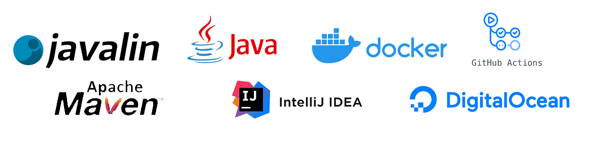

# Backend Development

This flow is designed to help you understand the basics of backend development. You will learn how to create Restfull APIs using Java and Javalin, and how to deploy them to the cloud using Github Actions, Docker Hub, and a virtual machine on Digital Ocean.

