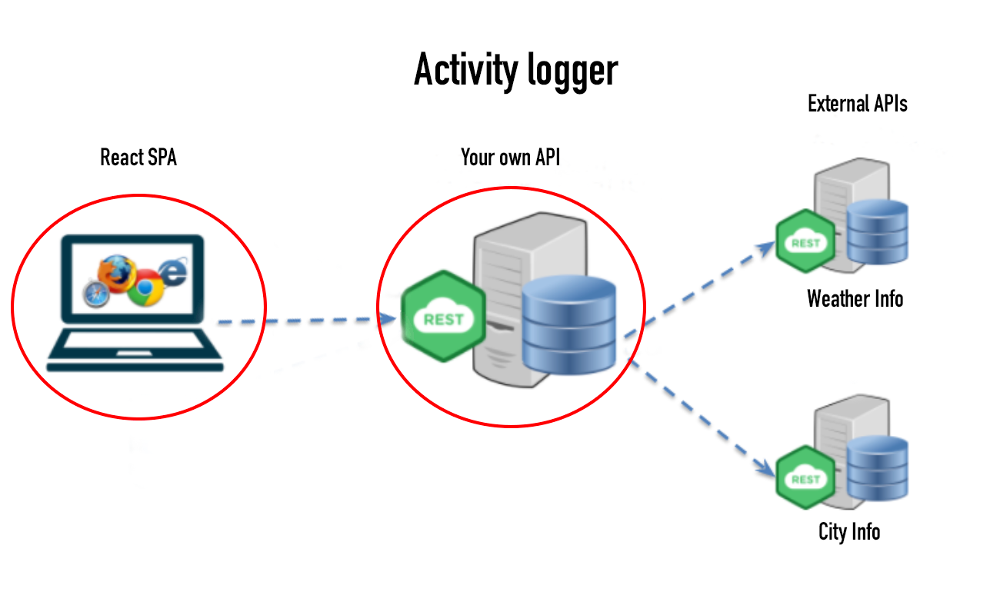
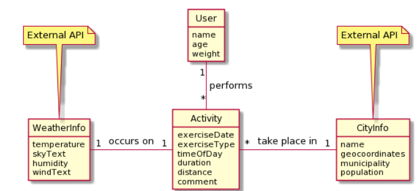

# Activity Logger Exercise Part 1

Your task is to create a proof of concept solution for a site where people can log their fitness activities. More precisely for walking, jogging og cycling. Many advanced systems exist on the market today, like Stava, Garmin Connect, Endomondo, Nike+, but for many people these apps are overly complicated. So we go simple.

The idea is that a user can log an exercise activity on a website and then the system will **enrich the data** from two external APIs. Namely with weather info from the current day and a few data about the city in which the exercise took place. See illustration below:



You will be able to build a real solution with a frontend later this semester. But for now we will focus on the backend. In this exercise, we will focus on getting the data from the APIs, storing the data in memory in DTOs. Later we might want to add the data to a database with JPA. But not today.

## The data

All data will be held in an `ActivityDTO`. The `ActivityDTO` will contain / reference a `WeatherInfoDTO` and a `CityInfoDTO`. The content of `WeatherInfoDTO` and `CityInfoDTO` can be obtained from two external APIs. The domain model may look like this:

## Domain model



## External API-servers to be used in this exercise

- WeatherInfo: [https://vejr.eu/pages/api-documentation](https://vejr.eu/pages/api-documentation)
- CityInfo: [https://dawadocs.dataforsyningen.dk/dok/stednavne](https://dawadocs.dataforsyningen.dk/dok/stednavne)

## Examples on external api-calls

- To get the current weather in Roskilde: [https://vejr.eu/api.php?location=Roskilde&degree=C](https://vejr.eu/api.php?location=Roskilde&degree=C)

- To get info about the city of Roskilde: [https://dawa.aws.dk/steder?hovedtype=Bebyggelse&undertype=by&prim%C3%A6rtnavn=Roskilde](https://dawa.aws.dk/steder?hovedtype=Bebyggelse&undertype=by&prim%C3%A6rtnavn=Roskilde).

OBS! The DAWA API need to have http version set to 1.1 to work. This can be done by adding the following line of code to your `HttpClient` (`.version(HttpClient.Version.HTTP_1_1)`):

```java
HttpRequest request = HttpRequest
                    .newBuilder()
                    .version(HttpClient.Version.HTTP_1_1)
                    .uri(new URI(encodedURL))
                    .GET()
                    .build();
```

## The exercise

1. Take a close look at the domain model and the external APIs. What data do you need to get from the APIs? What data do you need to store in the `ActivityDTO`?

2. Create a `WeatherInfoDTO` and a `CityInfoDTO` that can hold the data from the external APIs.

3. Create an `ActivityDTO` that can hold the data from the external APIs + extra data that you might want to add.

4. Create a `WeatherService` and a `CityService` that can fetch data from the external APIs and return the data in the form of a `WeatherInfoDTO` and a `CityInfoDTO`.

5. Create a `ActivityService` that can create an `ActivityDTO` and enrich it with data from the `WeatherService` and the `CityService`.

6. Create a integration test that can test the `ActivityService` and the `WeatherService` and the `CityService`.
