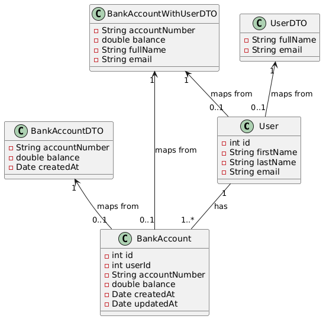

# DTOs: When, Why, and How to Use Them

## The Problem - read and understand

In web applications, we often need to send data between different layers (e.g., from the server to the client). You have a few options when returning data from a controller method:

1. Return the domain model / entity directly.
2. Return a Data Transfer Object (DTO).

But when should you use a DTO instead of an entity? What is the purpose of a DTO, and how does it help in building maintainable, scalable applications?

## The Solution

The choice between returning an entity or a DTO depends on several factors, including security, performance, and the need to decouple your internal logic from the external API.

You should use a **DTO** when:

- You want to limit which attributes of an entity are exposed to the client (e.g., hiding sensitive data).
- You need to transform or aggregate data to create a custom response format.
- You want to decouple your domain model / entity from the API contract to allow independent evolution of each.

You might return the **entity directly** in simpler scenarios, where you trust the consumer of the data (e.g., internal microservices) or when exposing all fields from the entity is acceptable.

---

## Scenario 1: Returning an entity Directly

You have a `City` entity representing cities with the following attributes:

```java
public class City {
    private Long id;
    private String name;
    private String zipCode;
    private String state;
    private String country;
    private String mayorName;
    private double budget;
    // Getters and setters
}
```

Your controller / service method returns this entity:

```java
public City showCity() {
    return new City("New York", "10001", "NY", "USA", "John Doe", 5000000);
}
```

Your view renders all the attributes directly:

```html
<h1>City Information</h1>
<p>City: {{city.name}}</p>
<p>Zip Code: {{city.zipCode}}</p>
<p>State: {{city.state}}</p>
<p>Country: {{city.country}}</p>
<p>Mayor: {{city.mayorName}}</p>
<p>Budget: ${{city.budget}}</p>
```

In this case, the entire city object is exposed to the client. This approach can lead to **over-exposing data**, such as the mayor’s name or the city’s budget, which may not be necessary for the client. Additionally, if the entity changes (e.g., adding sensitive internal fields), you risk unintentionally exposing new data.

---

## Scenario 2: Using a DTO

To avoid exposing unnecessary or sensitive fields, you can introduce a **DTO**. A DTO is a lightweight object that carries only the data you want to share with the client.

Here’s a `CityDTO` that includes only the essential public information:

```java
public class CityDTO {
    private Long id;
    private String name;
    private String zipCode;
    private String state;
    private String country;
    
    public CityDTO(Long id, String name, String zipCode, String state, String country) {
        this.id = id;
        this.name = name;
        this.zipCode = zipCode;
        this.state = state;
        this.country = country;
    }
    
    // Getters
}
```

In your controller, you now map the `City` entity to `CityDTO`:

```java
public CityDTO showCity() {
    City city = new City(1L, "New York", "10001", "NY", "USA", "John Doe", 5000000);
    return new CityDTO(city.getId(), city.getName(), city.getZipCode(), city.getState(), city.getCountry());
}
```

Your view renders only the DTO fields:

```html
<h1>City Information</h1>
<p>ID: {{city.id}}</p>
<p>City: {{city.name}}</p>
<p>Zip Code: {{city.zipCode}}</p>
<p>State: {{city.state}}</p>
<p>Country: {{city.country}}</p>
```

Here, the sensitive fields like `mayorName` and `budget` are not exposed, providing better control over what data the client can access.

---

### Common Mistakes and Misconceptions

- **Returning an entity Instead of a DTO**:
  When exposing your domain model / entity, you risk revealing unnecessary or sensitive data to external systems or clients. It also tightly couples your API response structure to your internal entity, making future changes difficult.

- **Creating a DTO That Is a Direct Copy of an entity**:
  If your DTO is simply a 1-to-1 copy of your entity, it doesn’t add much value. A DTO should focus on what the client needs, potentially merging or transforming data from multiple entities, reducing over-fetching, and ensuring clarity in API responses.

- **Adding Business Logic to a DTO**:
  DTOs are meant to be simple containers for data, not for business logic. Business logic should remain in the entity or service layer to maintain separation of concerns.

---

### Review

- A **DTO (Data Transfer Object)** is a lightweight class used to carry data between layers of an application, often between the backend and frontend. It contains no business logic, just data.
- A **Model / Entity** typically represents the domain entity in the business layer and can contain logic and relationships.
- **Use a DTO** when:
  - You need to control or limit the data exposed to the client.
  - You want to ensure API response structures are decoupled from internal models.
  - You need to aggregate data or create custom projections for specific use cases.

#### Summary

In summary, DTOs are used to create a clear boundary between your internal model / entities and the data that gets exposed to external systems. They help ensure that your API remains flexible, maintainable, and secure by giving you full control over what is returned to the client.

---

### Further Exercises

1. Create a new model / entity, `Person`, with attributes like `firstName`, `lastName`, `dateOfBirth`, and `socialSecurityNumber`.
2. Write a DTO, `PersonDTO`, that only exposes the person's `firstName` and `lastName`, hiding the `dateOfBirth` and `socialSecurityNumber`.
3. Write a controller / service method that maps `Person` to `PersonDTO` and returns it to the client.
4. You are given an entity called `User` with the following attributes:

- `id` - integer
- `first_name` - string
- `last_name` - string
- `email` - string

You are given an entity called `BankAccount` with the following attributes:

- `id` - integer
- `user_id` - integer
- `account_number` - string
- `balance` - double
- `created_at` - date
- `updated_at` - date

Task 1: Create a DTO called `UserDTO` with the following attributes:

- `fullName` - string
- `email` - string

Task 2: Create a main method that creates a `User` object and a `UserDTO` object.

Task 3: Print out the fullName from the `UserDTO` object.

Task 4: Create a DTO called `BankAccountDTO` with the following attributes:

- `accountNumber` - string
- `balance` - double
- `createdAt` - date

Task 5: In the `main()` method create a `BankAccount` object and a `BankAccountDTO` object.

Task 6: Create a DTO called `BankAccountWithUserDTO` with the following attributes:

- `accountNumber` - string
- `balance` - double
- `fullName` - string
- `email` - string

Task 7: In the main method create a `BankAccountWithUserDTO` object with help from the User and BankAccount objects.

Task 8: Print out the fullName and balance from the `BankAccountWithUserDTO` object.

## UML Class diagram for inspiration


