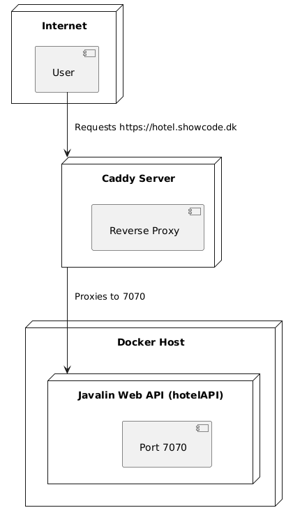

{: .mx-auto .d-block .my-5 .md .d-md-none  style="width: 25%;"}
{: .d-none .d-md-inline-block .ml-3 .mb-5 .float-right style="width: 25%;"}

# Caddy Setup

We use [Caddy Server](https://caddyserver.com/) to handle the domain and SSL certificates for our applications. In this exercise, you will learn how to set up Caddy Server to serve your application over HTTPS.

{: .mx-auto .d-block .my-5 .md .d-md-none style="width: 50%;" }
{: .d-none .d-md-inline-block .ml-3 .mb-5 .float-right style="width: 50%;"}

## Introduction

Caddy is a powerful, enterprise-ready, open-source web server with automatic HTTPS written in [Go](https://en.wikipedia.org/wiki/Go_(programming_language)). It is designed to be easy to use and configure while providing a secure and efficient web server. Caddy is a great choice for serving web applications and websites, especially when you need to handle HTTPS and domain management. Later in the semester, we will also use Caddy to serve static web pages for deploying frontend React applications.

## Prerequisites

1. You will need to have a Docker Image on Docker Hub with your Javalin application. If not, then follow the [Actions and Docker Hub tutorial](./actions_dockerhub.md) tutorial first.
2. You should also have a Javalin application running on your Droplet in a Docker Container. If that is not the case, then follow the [Watchtower tutorial](./watchtower.md) tutorial first.
3. You will need to buy a domain name and setup the DNS at Digital Ocean.
4. You should have created a subdomain for your Javalin application. For example, if your domain is `mydomain.com`, then you could create a subdomain like `hotel.mydomain.com` for your Javalin application.

## Step 1: Updating the Docker Compose File

To add the Caddy server to this Docker Compose file, you can connect it to both the `backend` network (to interact with `db`) and an additional `frontend` network for communication with the `hotelAPI`. This setup allows Caddy to serve as a reverse proxy for the Javalin API while keeping the `db` service on its dedicated network.

Here’s how you can modify the Docker Compose file to include Caddy:

### Updated Docker Compose File

```yaml
version: '3'
services:
  db:
    image: postgres:16.2
    container_name: db2sem
    mem_limit: 1536MB
    mem_reservation: 1024MB
    restart: unless-stopped
    networks:
      - backend
    environment:
      POSTGRES_USER: postgres
      POSTGRES_PASSWORD: <dit_sikre_password>
    volumes:
      - ./data:/var/lib/postgresql/data/
      - ./db/init.sql:/docker-entrypoint-initdb.d/init.sql
    ports:
      - "5432:5432"
    healthcheck:
      test: ["CMD-SHELL", "pg_isready -U postgres"]
      interval: 30s
      timeout: 10s
      retries: 5
      start_period: 10s

  hotelAPI:
    image: your-dockerhub-username/hotelAPI:latest
    container_name: hotelAPI
    ports:
      - "7070:7070"
      environment:
      - DEPLOYED=true
      - DB_NAME=hotel
      - DB_USERNAME=postgres
      - DB_PASSWORD=<dit_sikre_password>
      - CONNECTION_STR=jdbc:postgresql://db:5432/
      - SECRET_KEY=4c9f92b04b1e85fa56e7b7b0a34f2de4f5b08cd9bb4dfe8ac4d73b4f7f6ef37b
      - ISSUER=Dit navn
      - TOKEN_EXPIRE_TIME=1800000
    depends_on:
      db:
        condition: service_healthy
    networks:
      - backend
      - frontend

  watchtower:
    image: containrrr/watchtower
    container_name: watchtower
    restart: unless-stopped
    volumes:
      - /var/run/docker.sock:/var/run/docker.sock
    environment:
      - WATCHTOWER_INTERVAL=300
      - WATCHTOWER_CLEANUP=true
    command: hotelAPI

  caddy:
    image: caddy:latest
    container_name: caddy
    restart: unless-stopped
    ports:
      - "80:80"
      - "443:443"
    volumes:
      - ./Caddyfile:/etc/caddy/Caddyfile
      - caddy_data:/data
      - caddy_config:/config
    networks:
      - frontend

networks:
  backend:
    name: backend
    driver: bridge
  frontend:
    name: frontend
    driver: bridge

volumes:
  caddy_data:
  caddy_config:
```

### Explanation of Changes

- **Networks:**
  - **backend**: The `hotelAPI` and `db` services are connected to this network to allow them to communicate internally.
  - **frontend**: A network for the `hotelAPI` and `caddy` services. This enables the Caddy server to proxy requests to `hotelAPI` without exposing the database on this network.

- **Caddy Service Configuration:**
  - Caddy is only connected to the `frontend` network, as it doesn’t need to access the database.
  - It uses volumes to mount the `Caddyfile` and persist configuration data.

- **hotelAPI Configuration:**
  - The `hotelAPI` service is now on both the `backend` and `frontend` networks, allowing it to interact with both the database and the Caddy server.

## Step 2: Example Caddyfile Configuration

In the `Caddyfile`, configure the reverse proxy for the Javalin API:

```caddyfile
hotel.showcode.dk {
    reverse_proxy hotelAPI:7070
}
```

## Step 3: Running the Setup

To start everything, use:

```bash
docker-compose up -d
```

This setup ensures that:

- Caddy can serve requests from `hotel.showcode.dk` and route them to the `hotelAPI`.
- The `db` service is isolated on the `backend` network and isn’t accessible from the `frontend`, which enhances security by reducing direct access to the database from outside sources.

## The final setup with network configuration

Below is a visual representation of the network configuration for the services:


