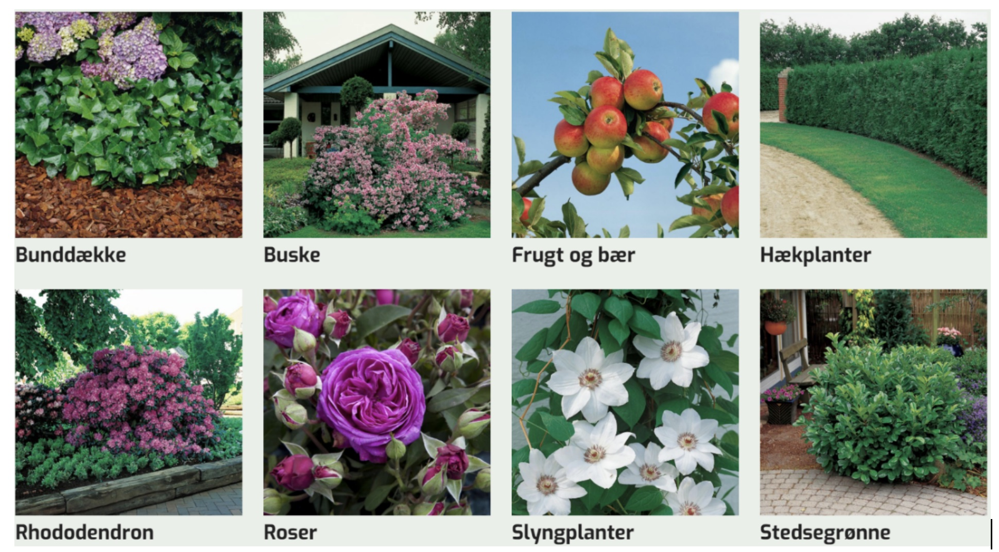

# Mock Exam: Programming and Technology

November 2024, the exam duration is set to 4 hours

## Exam guidelines

All written materials, PCs, laptops and internet resources are permitted during the examination.

We expect you to use code from your previous assignments and projects, otherwise you will not have time to complete the exam.

Mobile phones and communication with anyone other than the examiner, censor and proctor are prohibited.

You are not allowed to store your solutions on external networks, drives/hosts such as GitHub, Facebook, Google Drive, DropBox, OneDrive or similar. Breach of this rule will result in disqualification from the examination and appropriate sanctions will be imposed on both the sender/uploader and the recipient.

At the end of the exam, you must upload your entire project to Wiseflow. Your upload should be in the form of a zip file containing all your solutions and the document with your answers to the theoretical questions (a **`README.md`** file).

The exam duration is 4 hours. You may only leave the exam room for restroom breaks. Smoking is not allowed.

Later in the week, an individual assesment round will take place. This will take 30 minutes per student.

OBS! Since this is a Mock-exam - the real exam will be different, but in the naborhood of this mock-exam.

## Introduction

You are required to program parts of a backend for an online web shop, including adding new items to the web shop and more.

In addition to programming this system, there will be theoretical questions along the way where you will be asked to explain considerations and provide explanations. These should be written in a document (a **`README.md`** file), which should be uploaded to Wiseflow along with your code.

## Domain Description

Lyngby Garden Center and other Plant Resellers want to sell garden plants online. Garden plants are displayed with information such as plant type (Roses, Rhododendrons, shrubs, ...), name, size, and price.



More specifically, you need to program a system that can handle the following properties for plants:

- id, a unique identifier
- planttype
- name
- price
- maxheight

Plant properties/data can be displayed as in the table below:

| id | planttype       | name         | maxheight | price  
|----|-----------------|--------------|-----------|--------|
| 1  | Rose            | Albertine    | 400       | 199.50 |
| 2  | Bush            | Aronia       | 200       | 169.50 |
| 3  | FruitAndBerries | AromaApple   | 350       | 399.50 |
| 4  | Rhododendron    | Astrid       | 40        | 269.50 |
| 5  | Rose            | The DarkLady | 100       | 199.50 |

There are, of course, many more plants, but they are not shown here.

## Task 1: Build a REST Service Provider with Javalin

1.1 Create a Java project using the javalin framework

1.2 Create a **`README.md`** file in your project. This file should contain your answers to the questions, that need a written answer. We have marked those questions with a **`README.md`** tag. Please add task numbers for each answer.

1.3 Implement a `PlantDTO` class with properties: `id, planttype, name, maxheight, and price`.

1.4 Develop an API in Javalin with the following endpoints:

| HTTP method | REST Ressource            | json                                                                                                                                                                                                    | Comment
|-------------|---------------------------|---------------------------------------------------------------------------------------------------------------------------------------------------------------------------------------------------------|-------------------------------------------------------------------------------------|
| GET         | `/api/plants`             | `response:` [{"id": 1, "planttype": "Rose", "name": "Albertine", "maxheight": 400, "price": 199.50}, ...]                                                                                               | Retrieve all plants                                                                 |
| GET         | `/api/plants/{id}`        | `response:` {"id": 1, "planttype": "Rose", "name": "Albertine", "maxheight": 400, "price": 199.50}                                                                                                      | Retrieve a plant by its ID                                                          |
| GET         | `/api/plants/type/{type}` | `response:` [{"id": 1, "planttype": "Rose", "name": "Albertine", "maxheight": 400, "price": 199.50}, ...]                                                                                               | Retrieve plants by type                                                             |
| POST        | `/api/plants`             | `request payload:` {"planttype": "Rose", "name": "Gallicanae", "maxheight": 350, "price": 299.0} <br>`response:` {"id": 6, "planttype": "Rose", "name": "Gallicanae", "maxheight": 350, "price": 299.0} | Add a new plant. The created plant object should be returned with the assigned `id` |y | 100       | 199.50 |

The solution should include:

1.4.1 Routing as shown above in section 1.4.

1.4.2 A controller, `PlantController`, based on an interface `IPlantController`. The controller methods should each generate a `json` response.

1.4.3 To begin with, the data should be held in an in-memory Java datastructure, which means that we "mock" the database. For this, create a DAO class, `PlantDAOMock` (or use your own naming). Manage the list of plants in the `PlantDAOMock` as a static arraylist or a hashmap.
The `PlantDAOMock` should have these methods:

```java
List<PlantDTO> getAll()
PlantDTO getById(int id)
List<PlantDTO> getByType(String type)
PlantDTO add(PlantDTO plant)
```

1.5 Create a `dev.http` file and test the endpoints. Copy the output to your **`README.md`** file to document that the endpoints are working as expected.

## Task 2: REST Errorhandling

2.1 In your implementation various exceptions may occur. Think about where these exceptions can happen, and how to handle them. Note in your **`REAMDME.md`** file for each endpoint which errors you handle, and which HTTP status codes you wish to return. Also when everything goes well. Like this:

| HTTP method | REST Ressource            | Exceptions and status(es) |
|-------------|---------------------------|---------------------------|
| GET         | `/api/plants`             |                           |
| GET         | `/api/plants/{id}`        |                           |
| GET         | `/api/plants/type/{type}` |                           |
| POST        | `/api/plants`             |                           |

(feel free to cut'n paste this markdown and fill out):

```markdown
| HTTP method | REST Ressource            | Exceptions and status(es) |
|-------------|---------------------------|---------------------------|
| GET         | `/api/plants`             |                           |
| GET         | `/api/plants/{id}`        |                           |
| GET         | `/api/plants/type/{type}` |                           |
| POST        | `/api/plants`             |                           |
```

2.2 Demonstrate how to handle some of the exceptions documented above. An exception should be returned from an endpoint request as json with these properties:

- status: The HTTP status code
- message: A message describing the error
- timestamp: The time of the error

Example:

```json
{
status: 404,
message: "Not found - /api/v1/plants/34",
timestamp: "2023-11-02 08:57:19.373"
}
```

## Task 3: Streams and Generics

Now add methods in the `PlantDAOMock` class that:

3.1 returns a list of plants with a maximum height of 100 cm using the `stream API`, `filter()` and a `predicate function`.

3.2 maps / converts a list of PlantDTOs to a list of Strings containing the plant names. Again use the `stream API` and the `map` function.

3.3 sorts a list of PlantDTOs by name using `streams`, `sorted()`, and a `Comparator`.

3.4 Please note in your **`README.md`** file which programming paradigm the `stream API` is inspired by.

### The next step is introducing generics

3.5. Create an interface named `iDAO` by using generics, so it works with `PlantDAOMock`. We will need the generic version later in `Task 4` when we start working with entities. But for now, the interface `iDAO` is only applied on `PlantDAOMock`. You will have to refactor `PlantDAOMock` to work with `iDAO`

3.6. Create a new DTO class: `ResellerDTO` with the following properties: id, name, address, phone. This is a suggestion for reseller data:

| id | name                | address       | phone    |
|----|---------------------|---------------|----------|
| 1  | Lyngby Plantecenter | Firskovvej 18 | 33212334 |
| 2  | Glostrup Planter    | Tværvej 35    | 32233232 |
| 3  | Holbæk Planteskole  | Stenhusvej 49 | 59430945 |

The `ResellerDTO` will be used in the next Task 4.

## Task 4: JPA

4.1 Setup a `HibernateConfig` class with a method that returns a `EntityManagerFactory`.

4.2 Implement a `Plant` entity class with the following properties: id, type, name, maxheight, price.

4.3 Implement a `Reseller` entity class with the following properties: id, name, address, phone, and a `ManyToMany` relationship to `Plant`. This means that a reseller (Plant Shop) can have many plants in stock, and each plant can be sold by many resellers.

4.4 Create a DAO class `PlantDAO` using JPA and Hibernate. The new DAO should implement `iDAO` and add 3 extra methods:

```java
List<Plant> getAll()
Plant getById(int id)
List<Plant> getByType(String type)
Plant add(PlantDTO plant)
// Extra methods that are not in iDAO:
Plant deletePlant(int id)
Reseller addPlantToReseller(int resellerId, int plantId)
List<Plant> getPlantsByReseller(int resellerId)
```

NOTE: You have the option to do task 4 and 5 together as TDD. Otherwise, test the DAO class manually in a static method.

4.5 The last step is to change the endpoints to persist data in the database instead of the mock-version we used earlier. Create a new controller called `PlantControllerDB` to replace `PlantController` - and hook up the handlers to your `PlantCenterDAO`.

4.7 Run the `dev.http` file and test the endpoints again. They should still work. Copy the output to your **`README.md`** file to document the output.

## Task 5: Create automated tests for the PlantCenterDAO class

5.1 Setup `@BeforeAll` to create the `EntityManagerFactory`.

5.2 Setup the `@BeforeEach` and `@AfterEach` methods to create the test objects (Plants and Resellers).

5.3 Create a test method for each of the methods in the `PlantDAO` class.

5.4 Please describe in you own words the main differences between regular unit-tests and tests done in this task in your **`README.md`** file.

## Task 6: Create a Test to test the REST endpoints

6.1 Create a test class for the REST endpoints.

6.2 Setup `@BeforeAll` to create the Javalin server, the `PlantControllerDB` and the `EntityManagerFactory` for test.

6.3 Setup the `@BeforeEach` and `@AfterEach` methods to create the test objects (Plants and Resellers).

6.4 Create a test method for each of the endpoints in the `PlantControllerDB` class.

6.5 Please describe in your own words why testing REST endpoints is different from the tests you did in Task 5. Write you answer in your  **`README.md`** file.
