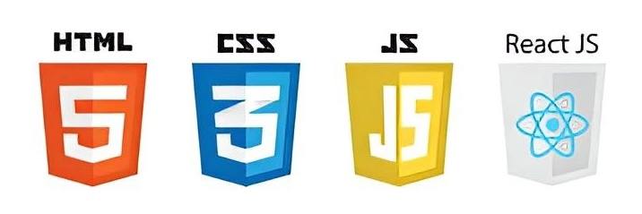

# Frontend

This flow is designed to help you understand the basics of frontend development. You will learn how to create websites using HTML, CSS, JavaScript, and React to create single-page applications.

