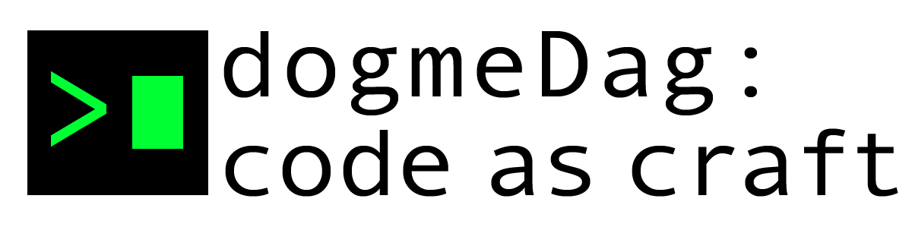

## Unplugged and unassisted – the essence of coding, one line at a time

## 1. Introduction

Welcome to Dogma Friday! This is a day where you will be coding without any assistance from AI or any other generative tools. A copy-paste free day in your life.  The goal is to test your understanding of the concepts you have learned so far and to improve your problem-solving skills, and ability to learn from official documentation.

## 2. The dogmas

On Dogma Friday, you are walking the straight and narrow path of the code warrior.

1. **"Analyse the problem first"**

   - Rule: No code until you have a clear plan. Use pen and paper to sketch your solution, and how you will break down the  problems.

2. **"No AI Assistance Tools"**

   - Rule: No AI, no code generators. Only you, your editor, and your knowledge. If you need to, then use the official documentation.

3. **"Handcrafted Code Only"**

   - Rule: Write every line from scratch. Copy-pasting from outside sources is off-limits. Think, type, and debug independently.

4. **"Simplicity is Key"**

   - Rule: Favor simple, clear solutions over complex or overly clever ones. Focus on readability and straightforward problem-solving.

5. **"Embrace the Bugs"**
   - Rule: Debug with logic and patience. No internet searches for error messages; use your understanding to solve issues.

## 3. The assignments

1. [Europe Map](./react_europe_map.md)

2. Create a React version of Tic Tac Toe (the version you made in CodeLab)

## 4. Upcoming monday review
