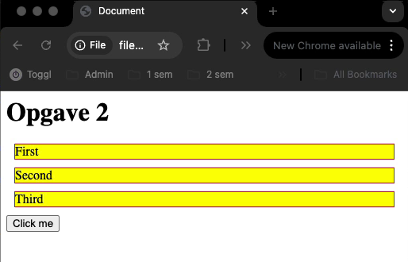
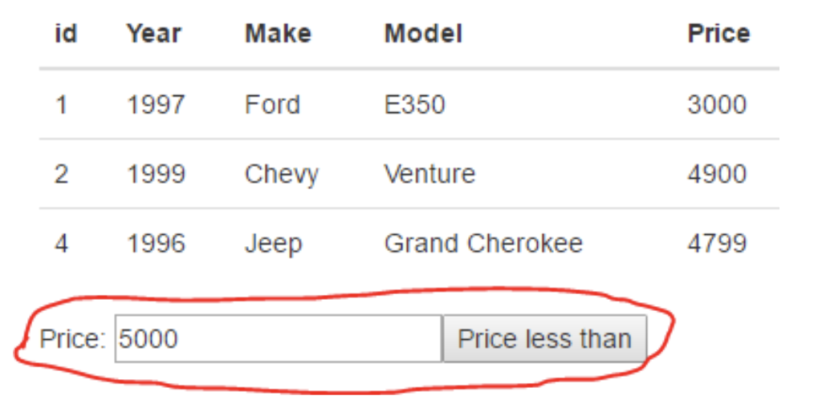

# Exercise 2: JS, DOM Manipulation and Events

## 2.1 Simple DOM Manipulation and Event Handling

**Make this exercise in Visual Studio Code and run the code in a browser.**

In this exercise, you will practice simple DOM manipulation and event handling. You can get help from the documentation in the Toolbox:

- [About the DOM](../../../toolbox/javascript/dom.md)
- [About selection elements in the DOM](../../../toolbox/javascript/dom_selection.md)
- [About manipulating the DOM a using events](../../../toolbox/javascript/dom_manipulation.md)

As usual, we adhere to the [KISS principle](https://en.wikipedia.org/wiki/KISS_principle). So, don't overthink the tasks. The layout will look something like this:

{: style="width:500px;" }

2.1.1 Add three divs to an HTML page, each with a unique id. When the page initially is loaded, all divs should be given a color of your choice.

- Hints: use `document.getElementsByTagName()` (will return an array of DOM Nodes) and `element.style.backgroundColor`.

2.1.2 Add a button, and assign a click handler to the button. When the button is clicked, each div should be given a unique color.

- Hints: use `document.getElementById(..)` to get the individual divs.

## 2.2 Event Bubbling and Event Arguments

You might want to check [out this page](https://javascript.info/bubbling-and-capturing), that describes event bubbling.

2.2.1 In a new HTML page, add two divs, each with a unique id. Style both ids with this class:

```css
.mydiv { 
  width: 25px; height: 25px;
  background-color: yellow; margin: 1px; 
}
```

2.2.2 Add a click handler to each id and write code, so when clicked, each div will write to the console "Hi from idOfTheDiv".

2.2.3 Now, using cut and paste, add 10 more divs (still each with a unique id).

2.2.4 Add a new div with the id="outer" around all our divs and assign a single click event handler (with the event argument) to this div.

2.2.5 Implement code to write to the console: The value of id pointed to by the target property (which you get from the event argument).

2.2.6 Add an empty paragraph tag, with an id, to your HTML and change the code for both exercises above so that output is not written to the console, but into this paragraph.

- Hint: Use the `innerText` property of an Element.


## 2.3 Using `map` to Create Lists (ULs, Tables, etc.)

In [exercise 1](./js_basics.md), you used an array type and `map` and `join` functions to create an `UL` with a number of names. Use this approach + DOM manipulation to insert the `UL` somewhere in an HTML page.:

2.3.1 Create a FORM with an input field + a submit button as sketched here.  

{: style="width:300px;" }

 2.3.2 Write the necessary code to add the new name to the array of names and regenerate the `<ul>` with the updated list.

- Hint: You will probably see, very shortly that the name is added, the screen flickers and it's gone again. The problem is that it submits to the server, so the full page is reloaded. To prevent this you can call `.preventDefault()` on the event argument which will prevent the default behavior (submit) and it should work. You can also use `preventDefault()` to prevent a link from actually forwarding to the link-address.

2.3.3 Add two more buttons to the form with the text: "remove first" and "remove last". Implement the behavior inspired by how you solved 2.3.1.

## 2.4 Using `map` and `filter` to Create Dynamic Table-Rows

In [exercise 1](./js_basics.md), you created a number of filter functions using the array given below:

```javascript
var cars = [
    { id: 1, year: 1997, make: 'Ford', model: 'E350', price: 3000 },
    { id: 2, year: 1999, make: 'Chevy', model: 'Venture', price: 4900 },
    { id: 3, year: 2000, make: 'Chevy', model: 'Venture', price: 5000 },
    { id: 4, year: 1996, make: 'Jeep', model: 'Grand Cherokee', price: 4799 },
    { id: 5, year: 2005, make: 'Volvo', model: 'V70', price: 44799 }
];
```

2.4.1 Use the `map` method to create a html table with all data.

- Write a function which, given this array, will return an HTML string with the array formatted as a Table as sketched in this figure:

{: style="width:500px;" }

4.4.2 Use the `filter` method to filter out items from the list.

- Add an input field and a button (provide each with an id), as sketched in this figure.

{: style="width:500px;" }

Write the necessary code so when the button is clicked, and the input field contains a number:

- A new filtered array is created having only prices lesser than the value provided.

- This array is passed to the function implemented in the previous step, and the DOM is updated with this new table.
