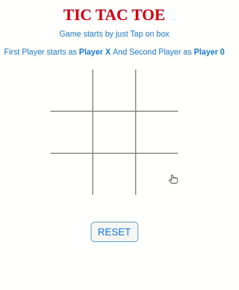

# Codelab Exercise 2: Implementing Tic-Tac-Toe (a.k.a. "kryds og bolle" )

{: .x .mx-auto .d-block .my-5 .md .d-md-none .w-50}
{: .d-none .d-md-inline-block .ml-3 .mb-5 .float-right width="200px"}

Make this game work.

## The toolbox

You will need to use the following:

- HTML
- CSS grid or flexbox could be smart
- JavaScript
  - Arrays
  - Functions
  - Variables
  - Conditional statements
  - Loops
- DOM selectors
- DOM manipulation
- Event handling
- Event bubbling / delegation
- Strategic thinking. Try to break the problem down into smaller parts.

## The rules

1. No AI support. Don't use chatGPT, Github Co-Pilot and other fancy stuff to solve this. You need to do it yourself.
2. Try not to copy what others have done on the web
3. The game should be able to detect a winner
4. The game should be able to detect a draw
5. The game should be able to restart

Tic Tac Toe is one of the most used games for teaching programming. And there is a reason for that. It's a simple game, but it can be implemented in many ways. And it's a good exercise for you to practice your programming skills - and learning Javascript and SPA development at the same time.

Have fun, and don't give up.
