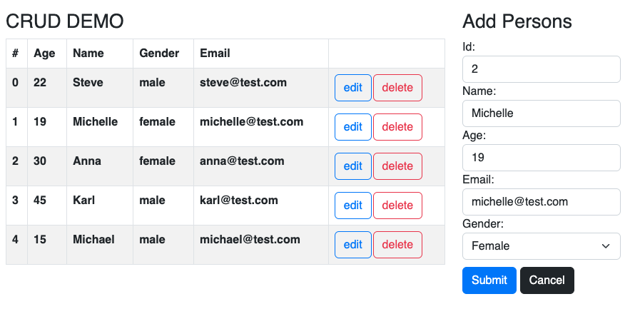

# React  CRUD & Form

This is a guided tutorial in which we will:

1. Fetch person data from an api ([JSON Server](https://www.npmjs.com/package/json-server))

2. Show a list of persons

3. Implement simple `CRUD` operations on the persons. This includes `GET`, `POST`, `PUT`, and `DELETE` http requests by using Javascripts' `fetch` method.

4. Do a little styling with css

We aim for something like this mockup:



## The video series

Code happily along with the [video tutorials](https://cphbusiness.cloud.panopto.eu/Panopto/Pages/Sessions/List.aspx?folderID=2ee87351-82f5-4bc9-addc-b0b9013e1dc7) - and use the snippets from this file when needed. In this way we can speed up the work a bit. The videos are called: `forms_01` to `forms_05`.

1. [Get started (16:23)](https://cphbusiness.cloud.panopto.eu/Panopto/Pages/Viewer.aspx?id=2f69f405-a1b8-4e0d-a9e5-b0c20110e8e3)
2. [Create components (8:05)](https://cphbusiness.cloud.panopto.eu/Panopto/Pages/Viewer.aspx?id=f81fe7a9-099a-4366-aa84-b0c20111517b)
3. [Get all persons (16:28)](https://cphbusiness.cloud.panopto.eu/Panopto/Pages/Viewer.aspx?id=0ed05562-8fbc-4ee2-bdfa-b0c2011394ed)
4. [Delete (20:28)](https://cphbusiness.cloud.panopto.eu/Panopto/Pages/Viewer.aspx?id=38c297ea-1511-424d-b770-b0c300dee4a7)
5. [Create and update (49:36)](https://cphbusiness.cloud.panopto.eu/Panopto/Pages/Viewer.aspx?id=6f937e84-afc9-4819-819b-b0c3010e3226)

These are the steps:

### 1. Getting the project configured

- Create a React project with [Vite](../../setup/vite.md)
- Cleaning up stuff

### 2. Using JSON server

- Configuring the JSON server. Copy this json snippet and insert into a `db.json` file.

```json
{
    "api":
    [
      {
        "id": 1,
        "age": "22",
        "name": "Steve",
        "email": "steve@test.com",
        "gender": "male"
      },
      {
        "id": 2,
        "age": "19",
        "name": "Michelle",
        "email": "michelle@test.com",
        "gender": "female"
      },
      {
        "id": 3,
        "age": "30",
        "name": "Anna",
        "email": "anna@test.com",
        "gender": "female"
      },
      {
        "id": 4,
        "age": "45",
        "name": "Karl",
        "email": "karl@test.com",
        "gender": "male"
      },
      {
        "id": 5,
        "age": "15",
        "name": "Michael",
        "email": "michael@test.com",
        "gender": "male"
      }
    ]
  }
```

A snippet for the `package.json`:

```json
    "jsonserver": "json-server --watch data/db.json --port 3000 --host 127.0.0.1"
```

Add the json server port to `vite.config.js` like this:

```javascript
import { defineConfig } from 'vite'
import react from '@vitejs/plugin-react'

// https://vitejs.dev/config/
export default defineConfig({
  plugins: [react()],
  server: {
    proxy: {
      '/api': 'http://127.0.0.1:3000'
    }
  }
})

```

Also, install the VS Code extention `REST Client` af Huachao Mao. This makes it possible to create a `dev.http` file to test out the api as we do it in IntelliJ.

This is a suggestion for a `dev.http` file for testing:

```plaintext
GET http://localhost:3000/api

###

GET http://localhost:3000/api/2

###

POST http://localhost:3000/api
Content-Type: application/json
Accept: application/application/json

{
    "age": "22",
    "name": "Steve",
    "email": "steve@test.com",
    "gender": "male"
  }

###

PUT http://localhost:3000/api/2
Content-Type: application/json
Accept: application/json

{
    "age": "22",
    "name": "Steve",
    "email": "steve@gmail.com",
    "gender": "male"
}

### 

DELETE http://localhost:3000/api/6
Accept: application/json
```

### 3. Creating components

- PersonForm.jsx

```html
<form>
    <label htmlFor="id">Id</label>
    <input name="id" id="1" type="number" readOnly placeholder="id" />
    <label htmlFor="name">Name</label>
    <input name="name" id="name" type="text" placeholder="name" />
    <label htmlFor="age">Age</label>
    <input name="age" id="age" type="number" min="1" max="120" placeholder="age" />
    <label htmlFor="email">Email</label>
    <input name="email" id="email" type="email" placeholder="email" />
    <label htmlFor="gender">Gender</label>
    <select name="gender" id="gender">
        <option defaultChecked>Select Gender</option>
        <option value="male">Male</option>
        <option value="female">Female</option>
        <option value="other">Other</option>
    </select>
    <button type="submit">Submit</button>
</form>
```

- PersonList.jsx

```html
<table className="table table-striped">
    <thead>
        <tr>
        <th>Id</th>
        <th>Name</th>
        <th>Age</th>
        <th>Email</th>
        <th>Gender</th>
        <th>Action</th>
        </tr>
    </thead>
    <tbody>
        <tr>
        <td>1</td>
        <td>Bingo</td>
        <td>34</td>
        <td>bingo@gmail.com</td>
        <td>Malicious</td>
        <td>
            <button>Edit</button>
            <button>Delete</button>
        </td>
        </tr>
    </tbody>
    </table>
```

### 4. Setting up states

### 5. Fetching persons from the JSON-server

Create a new folder `util` and a file `persistence.js`:

```react
export function fetchData(url, callback, method, body) {

    const headers =
        {
            'Accept': 'application/json'
        }

    if (method === 'POST' || method === 'PUT') {
        headers['Content-Type'] = 'application/json'
    }

    const options = {
        method,
        headers
    }

    if (body) {
        options.body = JSON.stringify(body);
    }

    fetch(url, options)
        .then(res => res.json())
        .then(data => callback(data))
        .catch(err => {
            if (err.status) {
                err.fullError.then(e => console.log(e.detail))
            } else {
                console.log("Network error");
            }
        })
}
```

### 6. Showing the persons

### 7. Inserting new persons
```react
const handleSubmit = (evt) => {
    evt.preventDefault();
    const formPerson = new FormData(evt.target);
    const person = Object.fromEntries(formPerson.entries());
    console.log(person);
    // fetch with POST
}

```

### 8. Editing persons

### 9. Deleting persons

### 10. Styling with html and css
- Make it look smashing ;-)

