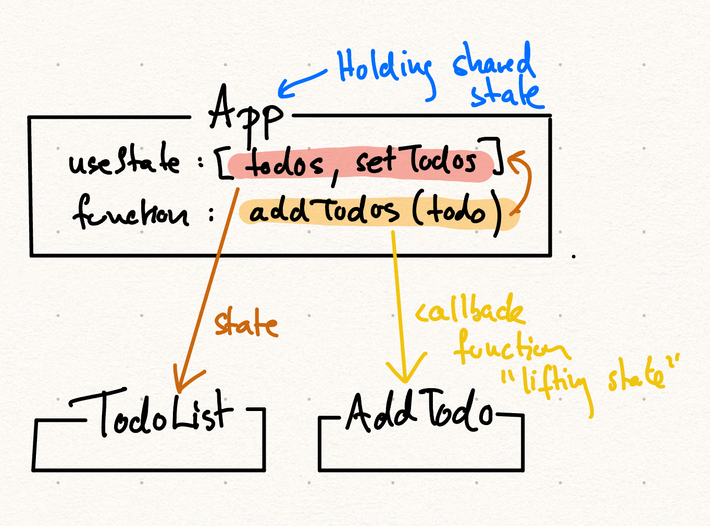

# React: Shared State. A.k.a. lifting state

## **Exercise: Simple Todo List**

### **Objective:**

1. Learn to manage state in a parent component.
2. Share state between sibling components by [lifting the state](../../../toolbox/react/lifting_state.md) to a common parent.
3. Learn to handle an input form using the [`controlled component`](../../../toolbox/react/controlled_component.md) pattern.

### The lifting state principle



---

## **Setup**

### 1. Create a new React app

Use [Vite](../../../toolbox/react/vite.md) to create, and then remove irrelevant code from the source code.

### 2. Create three components

- `App`: The parent component that holds the shared state.
- `AddTodo`: A child component where users can input and add todos.
- `TodoList`: A child component that displays the list of todos.

### 3. Add this App Component

```jsx
import React, { useState } from 'react';
import AddTodo from './AddTodo';
import TodoList from './TodoList';

const App = () => {
  const [todos, setTodos] = useState([]); // Shared state for todos

  const addTodo = (todo) => {
    setTodos([...todos, todo]); // Add a new todo to the list
  };

  return (
    <div>
      <h1>Todo List</h1>
      <AddTodo onAddTodo={addTodo} /> {/* Pass the state updater to AddTodo */}
      <TodoList todos={todos} /> {/* Pass the shared state to TodoList */}
    </div>
  );
};

export default App;
```

---

### 4. Add this AddTodo Component

```jsx
import React, { useState } from 'react';

const AddTodo = ({ onAddTodo }) => {
  const [inputValue, setInputValue] = useState('');

  const handleAdd = () => {
    if (inputValue.trim() === '') return; // Prevent empty todos
    onAddTodo(inputValue); // Call the function passed from the parent
    setInputValue(''); // Clear the input
  };

  return (
    <div>
      <input
        type="text"
        value={inputValue}
        onChange={(e) => setInputValue(e.target.value)}
        placeholder="Enter a todo"
      />
      <button onClick={handleAdd}>Add Todo</button>
    </div>
  );
};

export default AddTodo;
```

---

### 5. Add this TodoList Component

```jsx
import React from 'react';

const TodoList = ({ todos }) => {
  return (
    <ul>
      {todos.map((todo, index) => (
        <li key={index}>{todo}</li> // Display each todo
      ))}
    </ul>
  );
};

export default TodoList;
```

---

## Key Concepts to understand**

1. **State Management**:

   - The `App` component holds the shared `todos` state.
   - This state is passed down to the `TodoList` component as props.
   - A state updater function (`addTodo`) is passed to the `AddTodo` component as props.

2. **Props**:

   - The `App` component uses props to communicate with its child components.
   - `AddTodo` uses the `onAddTodo` prop to send data to the parent.
   - `TodoList` uses the `todos` prop to receive data from the parent.

3. **State Lifting**:

   - The `todos` state is lifted to the `App` component so that it can be shared between `AddTodo` and `TodoList`.

---

## **More Functionality to implement**

1. Add another component, `TodoCount`, that shows the total number of todos. Pass the `todos` array to it using props.
2. Modify the `TodoList` to allow removing a todo when clicking on it. Teach how to update the state from the child component via a callback function.
3. Style the application with css (make it nice and responsive)

---

## **Outcome**

By completing this exercise, you will:

- Understand how to manage shared state in React.
- Learn to lift state to a common parent component.
- Become comfortable passing data between parent and child components using props.

// test
