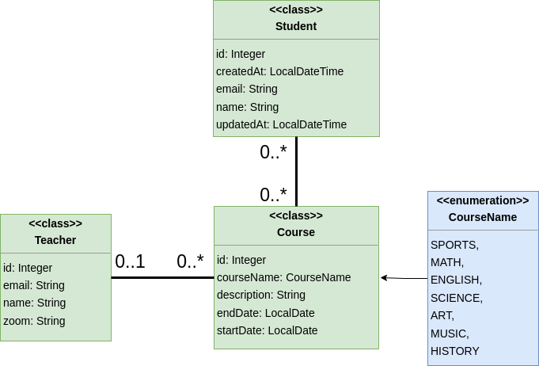
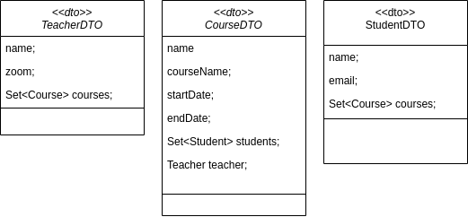

# JPA part II - CodeLab Exercise

This CodeLab exercise is designed to help you practice the concepts you have learned on the first day of JPA part 2. You will be working on a series of tasks that involve Java Persistence API, with Entities and DAOs. We will also practice [pair programming](../../toolbox/sys/projectmanagement/pairprogramming.md) and collaboration using Github.

## Exercise Overview

## Instructions

### 1. Team up (2 x 2)

1. Team up in pairs of 2
2. Find another pair to team up with
3. [Create a team of 4 people in Moodle](https://cphbusiness.mrooms.net/mod/choicegroup/view.php?id=729403)

### 2. Set up the development environment (one per team of 2 x 2)

1. **ONE** team member should copy-paste the following link into a bash/cmd terminal: `git clone -b code-lab-3 https://github.com/tysker/3sem-codelab-exercises.git`. (This will clone the repository on the `code-lab-3` branch)
2. Delete the `.git` folder in the project folder.
3. Create a new GitHub repository and push the project to the new repository.
4. Make everybody else collaborators on the repo.
5. Here are a link to the [Hibernate Config file](https://gist.github.com/tysker/74eac7ad0dc0d52c3af8e87907d487e7) and the [pom.xml](https://gist.github.com/tysker/312d237728d58c84533aae6cad661307) dependencies if you need them.
6. Create a new branch: `develop` and Protect the `main` branch and the `develop` branch from pushing directly to it. Only allow Pull Requests to merge into these branches.
7. Every team member should clone the new repository to their local machine
8. Checkout the develop branch (each member)

### 3. Connecting to the database

1. Each member should create a database in your docker environment with postgres called `university`.
2. Set up the HibernateConfig file to connect to the database.

### 4. The assignment

You are going to create a simple application for a university. The application should be able to manage students, courses and teachers. This time around we are going to add relationships between the entities. The relationships can be seen in the diagram above.
Most of the code is already written for you. You need to implement the missing parts. Make sure to use the correct annotations for the relationships and try to understand how the relationships work.

**Remember to write integration tests for the DAO classes.**

Ask yourself the following questions before you start implementing the relationships:

- What are the relationship between the entities?
- Which one should be the owning side of the relationship and what does that mean?
- Should the relationship be unidirectional or bidirectional?
- What cascade type should be used or should we use them at all? What are the implications?
- Should we use fetch type eager or lazy and why?

### 5. Identify tasks, break them down and assign to pair programmers as Issues in Github

The following tasks are suggestions for the first round of tasks. You can add more tasks as you go along.

1. Create an Enum for the Course class as shown in the diagram and add the correct annotations to the Course class.
2. Add the correct annotations to the Teacher class as shown in the diagram.
3. Add the correct annotations to the Student class as shown in the diagram.
4. Implement the GenericDAO interface for the CourseDAO class and implement the methods.
5. Implement the GenericDAO interface for the TeacherDAO class and implement the methods.
6. Implement the GenericDAO interface for the StudentDAO class and implement the methods.
7. Add the relations between the entities as shown in the diagram.
   - a) student can attend many courses
   - b) a course can have many students
   - c) course can have only one teacher
   - d) a teacher can teach many courses
8. Look at the [DTO](../../toolbox/designpatterns/dto.md) diagram below and implement the methods in the DAO classes to get the data as shown in the diagram.

### 6. Start working on the tasks (round 1)

1. Create a branch off the `develop` branch for each task
2. Work on the tasks in pairs

### 7. Pull request

1. Create a Pull Request to merge the task branch into the `develop` branch
2. Assign the Pull Request to the other pair for review

### 8. Review ([description of how to conduct code reviews using pull requests](../../toolbox/sys/projectmanagement/codereviews.md))

1. Review the Pull Request
2. Provide feedback
3. Merge the Pull Request and delete the branch

### 9. Repeat

1. Identify the next tasks
2. Repeat steps 5-8 for the next tasks
