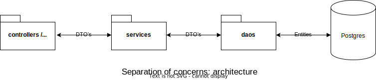

<br/><bt/>


# SP-1: Building a Movie Repository

Data can potentially be worth a lot of money. A common use case is to collect, store, and enrich related data from various sources (API's, webpages etc) - and then expose the data in useful places. Sometimes new and interesting products can emerge from this.

In this exercise we will train our data collecting skills using JPA, DTOs, Java streams, and fetching data from REST API's.

## General Requirements

This project is meant to be a group exercise and the scope is 4 working days. The requirements are as follows:

1. You are supposed to build part of a small backend, that can store and retrieve information about movies. The backend should be able to store information about movies, actors, genres, and directors. The backend should fetch movie data from the TMDb API (The Movie Database API).
2. After fetching data from the TMDb API, the backend should store the data in a database. The database should be built using JPA. It's okay the run the fetching methods and data storing form a main-method. Once it works, it's a once-only operation.
3. The JPA part should be implemented using Entities and DTOs.
        - The DTOs should be used to convert the movie `json` from the TMDb API with Jackson.
        - Also, the DTO's should be used as return types and arguments for the DAO methods. This means that the DTOs should be used to transfer data between the service layer / Main / tests methods, and the DAO layer.<br/><br/><br/><br/>
4. You should write DAO CRUD methods for the entities. The DAO methods should be implemented using JPA. You will also need to implement a service layer that uses the DAO methods.
5. You should write enough tests to cover the functionality of the backend. The tests should be written using JUnit and test containers.
6. Use as many of the concepts you have learned as possible as functional programming, streams, lambdas, generics, JPA, Lombok etc.
7. Share the code on Github for each group, and make sure that the code is well documented and that the code is clean and readable.

Below is a suggestion of how you can structure the project. You are free to structure the project as you see fit. Maybe it's a good idea to create a project in Github and then invite your group members to the project. Then you can work on the project together.

## Day 1

- Find a group to work with and [sign up on Moodle](https://cphbusiness.mrooms.net/mod/choicegroup/view.php?id=731119).
- Read the assignment carefully, and make sure you understand the requirements.
- Sketch a class diagram for the project. Which entities do you need? Which fields should the entities have? Which relationships should the entities have?
- Do some research on how to fetch the data from the TMDb API. You can use the [TMDB API reference] to get started.
- Create a new project in IntelliJ IDEA and set up the project structure. Make sure to use Maven as the build tool.
- Create the necessary DTOs to be able to convert the Json data. Make sure to use Lombok to reduce boilerplate code.
- Fetch all data from the TMDb API and print it to the console.
- Convert the DTOs to entities and save them in the database.

## Day 2

- Implement the DAO layer. Write the last CRUD methods for the entities.
- Implement the service layer. The service layer should use the DAO methods to fetch data from the database.

## Day 3

- Write tests for the DAO and service layer. Make sure to use JUnit and test containers.

## Day 4

- Make sure that the code is well documented and that the code is clean and readable.
- Share the code on Github.
- Hand in the [assignment on Moodle](https://cphbusiness.mrooms.net/mod/assign/view.php?id=731120) Make sure to include a link to the Github repository. One group member should hand in the assignment per group. NB! You can wait until Sunday evening to hand in the assignment.

## Day 5 (monday of the next week)

We keep going with our regular review groups. Prepare a short presentation of your project. You should be able to explain the structure of the project, the functionality of the backend, and the choices you have made. You should also be able to explain the code and the tests you have written.

## The functionality of the backend

The backend should be able to store and retrieve information about movies, genres, actors, and directors. We want the data to be stored in our own database. Once the data is stored in the database, we should be able to retrieve the data in various ways. It is not necessary to syncronize the data with the TMDb API. We only want to fetch the data once and store it in our own database.

We would like to be able to deliver the following functionality:

1. The database should contain all Danish movies from the TMDb API that has been released in the last 5 years. So just recent Danish movies. It would be around 1146 movies in total.
2. We would like to be able to see a list of all movies pulled from the database.
3. Each movie has a list of actors and a director. We would like to be able to see a list of all actors and directors as well that have been part of those movies. You need to figure out how to fetch and store the actors and directors in the database. Also, what kind of relationship should there be between the entities?
4. Each movie has a list of genres. We would like to be able to see a list of all genres as well. Also be able to list all movies within a particular genre. You need to figure out how to fetch and store the genres in the database. Also, what kind of relationship should there be between the entities?
5. In case you want to add a new movie to the database, you should be able to do that as well. You should also be able to update and delete movies from the database. Not necessarily all fields, but at least the title and the release date.
6. We would like to be able to search for a movie by title. The search should be case insensitive and should return all movies that contain the search string in the title.
7. We would like to be able to get the total average rating of all movies in the database, the top-10 lowest and highest rated movies, and the top-10 most popular movies.

## Bonus functionality (optional)

If your group has time, you can add the following functionality:

1. We would like to be able to see a list of all movies that a particular actor has been part of.
2. We would like to be able to see a list of all movies that a particular director has directed.
3. Make the backend able to fetch data again - and check if there are new movies in the TMDb API. If there are new movies, add them to the database. If there are movies that are no longer in the TMDb API, remove them from the database.
4. Fetch the movies from the TMDb API in parallel (more pages at the same time) by using `Futures`. Make sure to limit the number of parallel requests to the TMDb API. You can use the `ExecutorService` class to do this.

## Hints

### 1. **Spend time analyzing the problems**

You are free to choose the data model you find most suitable for the task. You don't necessarily need need to have relationships between all entities. You can also choose to store the data in a different way than described in the assignment. The most important thing is that the functionality is there. And then we are looking forward to seeing your solution and arguments. Make a lot of drawings and sketches to come to your solution. Pen and paper, however antique is sounds, is a good tool for this.

### 2. **API Key for TMDb**

- You will need an API key from TMDb to fetch movie data. In case you don't have one, you can get one by signing up [here](https://www.themoviedb.org/documentation/api).
- Rememeber never to push your api key to Github. Instead, you can use environment variables in IntelliJ to store the api key. You can access the environment variable in Java like this:

    ```java
    String apiKey = System.getenv("API_KEY");
    ```

### 3. **Clarify Entity Relationships**

Think about the relationship between movies and actors/directors (one movie can have many actors, but can one actor be in multiple movies?). You might want to use a many-to-many relationship here - or would you rather stay with a one-to-many to avoid complexity - and then live with some duplicates.

### 4. **API Json Data Structure**

Make sure you review the structure of the TMDb API responses for movies, actors, directors, and genres. You'll need this information to design your DTOs and entity mappings.

### 5. **Database Constraints**

Consider adding relevant constraints like `unique`, `not null`, or `length` to your entities to ensure data integrity.

### 6. **Error Handling**

Make sure to handle errors gracefully, such as what happens if a movie can't be found in the database. You can throw custom exceptions or return informative error messages.

### 7. **DTO vs Entity Mapping Clarity**

Ensure that DTOs are only used for communication with external systems (like the TMDb API or the main method / tests), while entities should only be used for communication with the database.

### 8. **Version Control and Collaboration**

- As you collaborate in groups, it might help to follow a Git branching strategy (e.g., developer branch and feature branches) to avoid conflicts. Make sure everyone commits regularly and uses descriptive commit messages.
- Also remember to use **pull requests** for code reviews as needed. It will be easier to delegate work the further you get into the project. In the beginning, it might be a good idea to work together on the same parts of the project to get a common understanding of the project.
