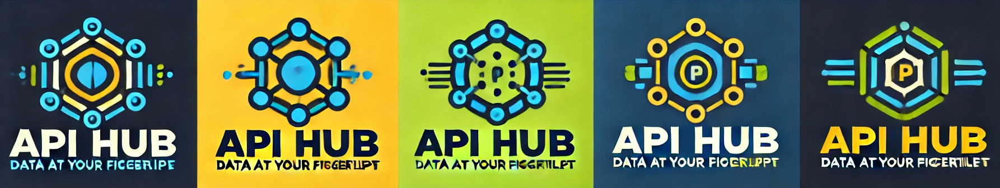

 <bt/>

# SP-3: The Frontend Hub

Earlier in the semester, we built a bunch of APIs. So the idea is to build a selection of cool React frontend applications that utilize the APIs. The frontend applications should be built with React, and you should use the tech stack we have used so far. This means that you should use React, React Router, and styling with CSS. The frontend applications should be deployed to a Digital Ocean Droplet. You should also use the deployment pipeline we have introduced. So GitHub Actions, Docker Compose file, and Watchtower to keep the frontend Container up to date. You should also use Caddy to serve the frontend over HTTPS on a sub-domain.

Each team decide on what kind of Frontend they would like to build. Be creative and have fun with it.

## API-hub

Take a peek at the [API-Hub](https://apihub.showcode.dk/) for inspiration.

## General Requirements

This project is meant to be a group exercise. Teams of 2-3 is preferable, but you can also make a solo project. The scope is 2 weeks. The most important requirement is that you have fun and learn something new.

Secondarily, you should:

- Use React
- Use React Router
- Use CSS and Styled Components for styling
- Deploy the frontend to a Digital Ocean Droplet
- Use GitHub Actions for CI/CD
- Implement login and authentication using JWT
- Implement CRUD operations as needed

Thirdly, you should:

- Look to the [frontend exam questions](../../exam/frontend/exam_questions.md), and see if you can include some of the topics in your project.
