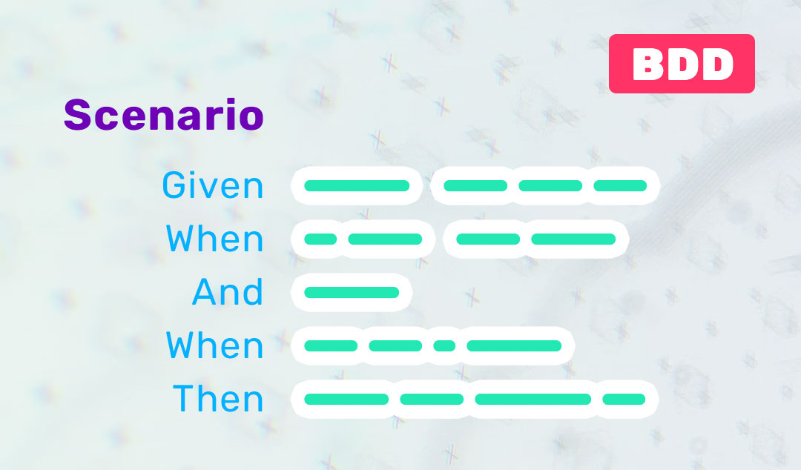

# Gherkin Syntax Exercises

Below are the exercises where you need to transform regular descriptions into **Gherkin syntax**. Each description outlines a typical test case, and your task is to convert these descriptions into Gherkin scenarios using the **Given-When-Then** structure.

---

### Instructions

1. For each description, write the Gherkin syntax in the following format:
   - **Feature:** (Briefly describe the feature being tested)
   - **Scenario:** (Describe the specific behavior being tested)
   - Use the **Given**, **When**, **Then**, and **And** steps to outline the scenario based on the description provided.

2. Pay attention to the conditions (Given), actions (When), and outcomes (Then) when structuring your scenarios.

---

### Exercise 1: User Login

**Description:**  
A user navigates to the login page, enters their correct username and password, and successfully logs in, seeing the homepage.

**Task:**  
Write the Gherkin version of this scenario.

---

### Exercise 2: Searching for a Product

**Description:**  
The user types "smartphone" into the search bar on the website, clicks the search button, and a list of matching products is displayed. The number of results is shown at the top.

**Task:**  
Convert this description into Gherkin syntax.

---

### Exercise 3: Retrieving User Data from an API

**Description:**  
An API call is made to fetch the details of a user with ID 456. The request is successful, and the API returns the user’s name as "Alice."

**Task:**  
Convert this description into a Gherkin test case.

---

### Exercise 4: Creating new User through a Web Form and a REST API

**Description:**  
A user fills out a registration form on a website, providing their name, email, and password. Upon submission, the form data is sent to a REST API endpoint, and a new user account is created in the system.

**Task:**  
Convert this description into a Gherkin test case.
