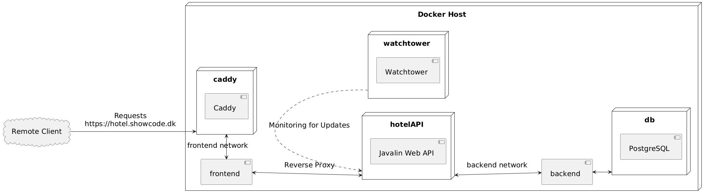

{: .mx-auto .d-block .my-5 .md .d-md-none  style="width: 25%;"}
{: .d-none .d-md-inline-block .ml-3 .mb-5 .float-right style="width: 25%;"}

# Caddy Setup

We use [Caddy Server](https://caddyserver.com/) to handle the domain and SSL certificates for our applications. In this exercise, you will learn how to set up Caddy Server to serve your application over HTTPS as a reverse proxy.

{: .mx-auto .d-block .my-5 .md .d-md-none style="width: 50%;" }
{: .d-none .d-md-inline-block .ml-3 .mb-5 .float-right style="width: 50%;"}

## Introduction

Caddy is a powerful, enterprise-ready, open-source web server with automatic HTTPS written in [Go](https://en.wikipedia.org/wiki/Go_(programming_language)). It is designed to be easy to use and configure while providing a secure and efficient web server. Caddy is a great choice for serving web applications and websites, especially when you need to handle HTTPS and domain management. Later in the semester, we will also use Caddy to serve static web pages for deploying frontend React applications.

## Prerequisites at this point

1. You will need to have a Docker Image on Docker Hub with your Javalin application. If not, then follow the [Actions and Docker Hub tutorial](./actions_dockerhub.md) tutorial first.
2. You should also have a Javalin application running on your Droplet in a Docker Container. If that is not the case, then follow the [Hotel API tutorial](./hotelAPI_setup.md) tutorial first.
3. You will need to buy a domain name and setup the DNS at Digital Ocean.
4. You should have created a subdomain for your Javalin application. For example, if your domain is `mydomain.com`, then you could create a subdomain like `hotel.mydomain.com` for your Javalin application.

## Step 1 (red pill): Merge docker compose files

If you went the red pill way on 2nd semester, you will have a `docker-compose.yml` file in the `~jetty/caddy_deployment` folder on your Droplet. This file configures the Caddy server to serve the Javalin application over HTTPS. You will also have a `Caddyfile` in the same folder that configures the reverse proxy for the Javalin API.

We want to keep all the Docker configurations in one compose file to simplify the deployment process. To do this, we will merge the Caddy and Javalin configurations from the `caddy_deployment` folder to the `2semDockerSetupRemote` folder. This will allow us to keep all the Docker configurations in one compose file and simplify the deployment process.

However, we recommend that you wait with this step until you have completed the other steps in these tutorials. This will ensure that you have a working setup before you start merging the Docker Compose files and you 2nd semester projects. So we begin with testing the hotelAPI first.

But when you have the hotelAPI up and running, then follow these steps to merge the docker compose files:

- [Red Pill Migration](./red_pill_migration.md)

## Step 2 (everyone): Updating the Docker Compose File

Move to the `~jetty/2semDockerSetupRemote` folder on your Droplet and open the `docker-compose.yml` file in an editor (nano).

To add the Caddy server to this Docker Compose file, you can connect it to both the `backend` network (to interact with `db`) and an additional `frontend` network for communication with the `hotelAPI`. This setup allows Caddy to serve as a reverse proxy for the Javalin API while keeping the `db` service on its dedicated network.

Here’s how you can modify the Docker Compose file to include Caddy:

### Add this into Docker Compose File

```yaml
  caddy:
    image: caddy:2.7.6
    restart: unless-stopped
    container_name: caddy
    ports:
      - "80:80"
      - "443:443"
    volumes:
      - ./Caddyfile:/etc/caddy/Caddyfile
      - ./site:/srv
      - ./caddy_data:/data
      - ./caddy_config:/config
    networks:
      - frontend
    depends_on:
      hotelAPI:
        condition: service_healthy

volumes:
  caddy_data:
  caddy_config:
  logs:
```

### Explanation of Changes

- **Networks:**
  - **backend**: The `hotelAPI` and `db` services are connected to this network to allow them to communicate internally.
  - **frontend**: A network for the `hotelAPI` and `caddy` services. This enables the Caddy server to proxy requests to `hotelAPI` without exposing the database on this network.

- **Caddy Service Configuration:**
  - Caddy is only connected to the `frontend` network, as it doesn’t need to access the database.
  - It uses volumes to mount the `Caddyfile` and persist configuration data.

## Step 3: Example Caddyfile Configuration

In the `Caddyfile`, configure the reverse proxy for the Javalin API:

```bash
nano Caddyfile
```

Enter the following configuration with you own domain name:

```plaintext
hotel.showcode.dk {
        reverse_proxy hotelAPI:7070
}
```

## Step 3: Running the Setup

To start everything, use:

```bash
docker compose up -d
```

This setup ensures that:

- Caddy can serve requests from `hotel.showcode.dk` and route them to the `hotelAPI`.
- The `db` service is isolated on the `backend` network and isn’t accessible from the `frontend`, which enhances security by reducing direct access to the database from outside sources.
- Notice the `healthcheck` configuration for the `db` and `hotelAPI` services. This ensures that the database is running before the `hotelAPI` container starts, and that the `hotelAPI` needs to be in a healty state before Caddy starts routing requests to it.

## The final setup with network configuration

Below is a visual representation of the network configuration for the services:



## Next steps

As a last step we will add Watchtower to the Docker Compose file to ensure that the containers are always up-to-date. Follow the [Watchtower Setup](./watchtower.md) tutorial to complete the deployment pipeline setup.
