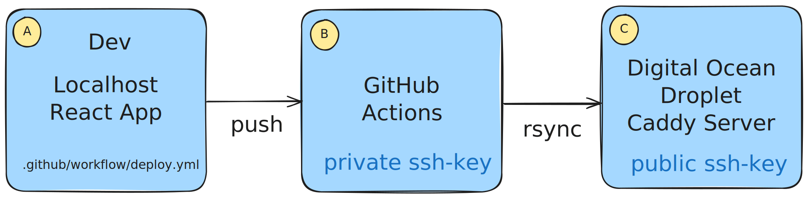

{: .mx-auto .d-block .my-5 .md .d-md-none  style="width: 100%;"}
{: .d-none .d-md-inline-block .ml-3 .mb-5 .float-right style="width: 40%;"}

# Deploying React Frontend Applications

In this tutorial, you will learn how to deploy a React frontend application using Github Actions and Caddy as a
static file server. Compared to deploying the Javalin Backend APIs it's not a big deal.

## Prerequisites at this point

1. You should have a React frontend application that you want to deploy.

2. You should have a Github repository for the frontend application.

3. You should have a Droplet with Caddy installed that you use for your backend deployment pipeline.

4. You should have a domain that can be used for accessing your frontend application.

## The Plan

This is the plan for deploying the React frontend application:

1. Create a **Github Action Workflow** that builds your React app and deploys it to the Droplet (A)
2. Create a didicated ssh-key for the deployment pipeline. This is to be able to copy the files to the Droplet (A)
3. Copy the public key to the Droplet (for the jetty user). From (B) to (C)
4. Create a Github Action Secret for the private key (B)
5. Add a "site block" to the Caddyfile on your Drolet for the frontend application (C)
6. Restart the Caddy container to apply the changes (C)
7. Push the React frontend application to the Github repository and wait for the deployment to complete (A)



The steps are annotated with letters (A, B, C) to indicate where they are performed:

### Step 1: Github Action Workflow (A)

Create a new directory `.github/workflows` in the root of your project, and add the file `deploy.yml`:

```yaml
name: Deploy Frontend to DigitalOcean

on:
  push:
    branches: [main] # Trigger on direct pushes to the main branch
  pull_request:
    branches: [main] # Trigger when a pull request targeting main is merged/closed

jobs:
  deploy:
    runs-on: ubuntu-latest # The type of runner for the job.

    steps:
      - name: Checkout code
        uses: actions/checkout@v4 # Checks out the repository under $GITHUB_WORKSPACE, so your workflow can access it.

      - name: Set up Node.js
        uses: actions/setup-node@v4 # Updated to use the latest version of the action
        with:
          node-version: '20.x' # Sets up Node.js version 20

      - name: Install dependencies
        run: npm install # Installs dependencies defined in package.json.

      - name: Build the React project
        run: npm run build # Runs the build script specified in package.json.

      - name: Set up SSH agent
        uses: webfactory/ssh-agent@v0.9.0
        with:
          ssh-private-key: ${{ secrets.DO_SSH_KEY }} # The SSH private key stored in GitHub secrets.

      - name: Sync files to DigitalOcean Droplet using rsync
        run: |
          # Define SSH connection info
          SSH_USER="jetty"
          DO_DROPLET_IP=${{ secrets.DO_DROPLET_IP }}
          APP_NAME="timer"
          REMOTE_PATH="/home/jetty/deployment/site/$APP_NAME/"

          # Sync build output to the Droplet using rsync
          rsync -avz --delete -e "ssh -o StrictHostKeyChecking=no" ./dist/ $SSH_USER@$DO_DROPLET_IP:$REMOTE_PATH
```

- Set the DO_DROPLET_IP variable to the IP address of your Droplet.
- Set the REMOTE_PATH variable to the path where the frontend application should be deployed on the Droplet.
- Set the APP_NAME variable to the name of your application. In this example it's called `timer`.

### Step 2: Generating a new SSH key for the deployment pipeline (A)

On your local machine, generate a new SSH key pair for the deployment pipeline:

Open a terminal - or Git Bash and run the following commands:

```bash
cd ~/.ssh
```

```bash
ssh-keygen -t rsa -C "your_email@example.com" -f ~/.ssh/deploy_key
```

- Press **Enter** twice when prompted for the passphrase to leave it blank.

- Check that the key pair has been created:

```bash
ls ~/.ssh/deploy_key*
```

Expected out:

```plaintext
/Users/your_username/.ssh/deploy_key
/Users/your_username/.ssh/deploy_key.pub
```

The private key is `deploy_key` and the public key is `deploy_key.pub`.

### Step 3: Copy the public key to the Droplet (A + C)

Start by copying the public key by doing this:

```bash
cat ~/.ssh/deploy_key.pub
```

Use the mouse and copy the content of the public key. Be careful not to copy any whitespace.

Login to your Droplet with the jetty user. If you can't login with the jetty user,
you can use the root user and then switch to the jetty user:

```bash
ssh root@your_droplet_ip
su - jetty
```

Now add the public key to the `~/.ssh/authorized_keys` file: (the file can have multiple keys - ctrl + E to go to the end of the file, then `Enter` the paste the new key)

```bash
nano ~/.ssh/authorized_keys
```

Paste the public key into the file and save it by pressing `Ctrl + X`, y and then `Enter`.

Done with the public key.

### Step 4: Create a Github Action Secret for the private key (B)

Copy the content of the private key:

```bash
cat ~/.ssh/deploy_key
```

1. Go to the Github repository for the frontend application and navigate to the **Settings** tab.

2. Click on **Secrets and Variables -> Actions** in the left sidebar and then click on **New repository secret**.

3. Add a new secret with the name `DO_SSH_KEY` and paste the content of the private key into the value field.

4. Click on **Add secret** to save the secret.

### Step 5: Add a "site block" to the Caddyfile (C)

On your droplet: navigate to the folder where your Caddyfile is located. In this example, it's `~jetty/deployment`.
In the folder, you should have a file called `Caddyfile`. Edit the Caddyfile with nano:

```bash
nano Caddyfile
```

Add a new site block for the frontend application:

```plaintext
timer.showcode.dk {
        root * /srv/timer
        file_server
        try_files {path} /index.html
}
```

- Replace `timer.showcode.dk` with the subdomain you want to use for the frontend application.
- Replace `/srv/timer` with the path where the frontend application should be deployed on the Droplet. Keep the `/srv/` prefix, but change the `timer` part to the name of your application. It should
match the `APP_NAME` variable in the Github Action Workflow.

Remember to configure your DNS settings to point the subdomain to the IP address of your Droplet. This is done in the DNS
settings of your domain provider. On Digital Ocean it's done in the [Networking domain tab](https://cloud.digitalocean.com/networking/domains).

### Step 6: Create App directory and Ensure Correct Ownership and Permissions (C)

On your droplet:

Create a directory for the frontend application (called `timer` in this example) in the path you specified in the Caddyfile:

```bash
mkdir -p /home/jetty/deployment/site/timer
```

Check the ownership and permissions of the target directory for the application.

```bash
ls -ld /home/jetty/deployment/site/timer
```

If the directory or files are not owned by `jetty`, fix this by changing ownership recursively:

```bash
sudo chown -R jetty:jetty /home/jetty/deployment/site/timer
```

Also, ensure that the permissions allow `jetty` to read, write, and delete files:

```bash
chmod -R u+rwX /home/jetty/deployment/site/timer
```

Check the permissions again:

```bash
ls -ld /home/jetty/deployment/site/timer
```

Expected output:

```plaintext
drwxr-xr-x 3 jetty jetty 4096 Nov 28 21:13 /home/jetty/deployment/site/timer
```

In docker-compose.yml file under the caddy service, add (if not already there) the volume for the frontend application:

```yaml
- ./site:/srv
```

or if you did not setup Caddy before:
  
  ```yaml
    caddy: image: caddy:2.7.6
    restart: unless-stopped
    container_name: caddy
    cap_add:
      - NET_ADMIN
    networks:
      - frontend
    ports:
      - "80:80"
      - "443:443"
    volumes:
      - ./Caddyfile:/etc/caddy/Caddyfile
      - ./site:/srv
      - ./caddy_data:/data
      - ./caddy_config:/config
  ```
  
### Step 7: Restart the Caddy container

After adding the site block to the Caddyfile, you need to restart the Caddy container to apply the changes:

```bash
sudo docker compose restart caddy
```

### Step 8: Push the React frontend application

Push the React frontend application to the Github repository:

That should be it. Watch the Github Actions tab in the Github repository to see the deployment in action.

### Step 9: Access the frontend application

Open your favorite browser and navigate to the subdomain you configured in the Caddyfile.
You should see the React frontend application.

This is the application used in this demo: [timer.showcode.dk](https://timer.showcode.dk)
