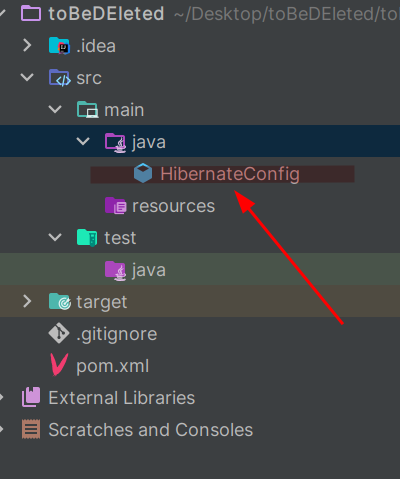

# JPA-Maven Setup in IntelliJ

## Technologies

- Maven
- Java 17
- JPA
- Hibernate
- PostgresSQL

## How-to

1. Open IntelliJ and create a new project.
2. Select Maven and Java 17 or higher.
3. In advanced settings, add groupId.
4. Click finish.

---


---

5. Open the pom.xml file and add the following dependencies:

```XML
 <dependencies>
        <!--  DB    -->

        <dependency>
            <groupId>org.postgresql</groupId>
            <artifactId>postgresql</artifactId>
            <version>42.6.0</version>
        </dependency>
        <dependency>
            <groupId>org.hibernate.orm</groupId>
            <artifactId>hibernate-core</artifactId>
            <version>${hibernate-version}</version>
        </dependency>

        <!--  LOMBOK    -->

        <dependency>
            <groupId>org.projectlombok</groupId>
            <artifactId>lombok</artifactId>
            <version>1.18.28</version>
            <scope>provided</scope>
        </dependency>

        <!--  TESTING      -->

        <dependency>
            <groupId>org.junit.jupiter</groupId>
            <artifactId>junit-jupiter-api</artifactId>
            <version>${junit.version}</version>
            <scope>test</scope>
        </dependency>
        <dependency>
            <groupId>org.junit.jupiter</groupId>
            <artifactId>junit-jupiter-engine</artifactId>
            <version>${junit.version}</version>
            <scope>test</scope>
        </dependency>
        <dependency>
            <groupId>org.junit.jupiter</groupId>
            <artifactId>junit-jupiter-params</artifactId>
            <version>${junit.version}</version>
            <scope>test</scope>
        </dependency>
</dependencies>
```

---

6. Add the following lines into the properties tag

```xml

    <hibernate-version>6.2.4.Final</hibernate-version>
    <junit.version>5.9.1</junit.version>
```

---

7. Create a new java class file called HibernateConfig.



## 8. Copy and paste the following [Link](https://gist.github.com/jonbertelsen/aad0bd7e1dcc6ed72d983c23dd2967ac) into the HibernateConfig.class

**If you get an import error, try to run Maven lifecycle "install"**


