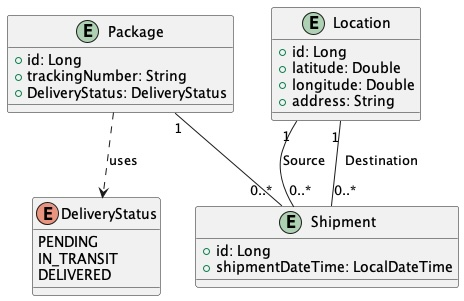

# JPA - Unidirectional vs. Bidirectional Relationships

In **JPA**, the difference between **unidirectional** and **bidirectional** `OneToMany` associations lies in how the entities reference each other. In a **unidirectional** relationship, only one entity knows about the relationship, while in a **bidirectional** relationship, both entities are aware of the relationship.

Let’s take the `Package` and `Shipment` example and explore both approaches. The example is taken from this Class Diagram:



### 1. **Unidirectional One-to-Many** Relationship

In a **unidirectional OneToMany** relationship, only the `Package` entity is aware of the relationship. The `Shipment` entity doesn’t have any reference back to `Package`.

#### Code Example (Unidirectional)

##### **Package Entity:**

```java
import jakarta.persistence.*;
import java.util.List;

@Entity
public class Package {

    @Id
    @GeneratedValue(strategy = GenerationType.IDENTITY)
    private Long id;

    private String trackingNumber;

    @OneToMany(cascade = CascadeType.ALL)
    @JoinColumn(name = "package_id") // Adds a foreign key (package_id) to the Shipment table
    private List<Shipment> shipments;

    // Constructors, Getters, and Setters
    public Package() {}

    public Package(String trackingNumber) {
        this.trackingNumber = trackingNumber;
    }

    public Long getId() {
        return id;
    }

    public String getTrackingNumber() {
        return trackingNumber;
    }

    public List<Shipment> getShipments() {
        return shipments;
    }

    public void setShipments(List<Shipment> shipments) {
        this.shipments = shipments;
    }
}
```

##### **Shipment Entity:**

```java
import jakarta.persistence.*;

@Entity
public class Shipment {

    @Id
    @GeneratedValue(strategy = GenerationType.IDENTITY)
    private Long id;

    private String description;

    // Constructors, Getters, and Setters
    public Shipment() {}

    public Shipment(String description) {
        this.description = description;
    }

    public Long getId() {
        return id;
    }

    public String getDescription() {
        return description;
    }
}
```

#### Key Points of Unidirectional

- The **`@JoinColumn(name = "package_id")`** annotation in the `Package` entity places a foreign key (`package_id`) in the `Shipment` table, creating the association.
- **`CascadeType.ALL`** ensures that when a `Package` is persisted, updated, or removed, the related `Shipment` entities are also persisted or removed.
- The **`Shipment` entity does not have a reference** to the `Package` entity, making this relationship unidirectional.

#### Table Structure

- The `Shipment` table will have a `package_id` foreign key column that links to the `Package` table.

---

### 2. **Bidirectional One-to-Many** Relationship

In a **bidirectional OneToMany** relationship, both `Package` and `Shipment` are aware of the relationship. The `Package` entity maintains a collection of `Shipments`, and the `Shipment` entity has a reference back to its owning `Package`.

#### Code Example (Bidirectional)

##### **Package Entity:**

```java
import jakarta.persistence.*;
import java.util.List;

@Entity
public class Package {

    @Id
    @GeneratedValue(strategy = GenerationType.IDENTITY)
    private Long id;

    private String trackingNumber;

    @OneToMany(mappedBy = "pkg", cascade = CascadeType.ALL, orphanRemoval = true)
    private List<Shipment> shipments;

    // Constructors, Getters, and Setters
    public Package() {}

    public Package(String trackingNumber) {
        this.trackingNumber = trackingNumber;
    }

    public Long getId() {
        return id;
    }

    public String getTrackingNumber() {
        return trackingNumber;
    }

    public List<Shipment> getShipments() {
        return shipments;
    }

    public void setShipments(List<Shipment> shipments) {
        this.shipments = shipments;
        for (Shipment shipment : shipments) {
            shipment.setPkg(this);  // Maintain the bidirectional link
        }
    }
}
```

##### **Shipment Entity:**

```java
import jakarta.persistence.*;

@Entity
public class Shipment {

    @Id
    @GeneratedValue(strategy = GenerationType.IDENTITY)
    private Long id;

    private String description;

    @ManyToOne
    @JoinColumn(name = "package_id", nullable = false) // Foreign key column in Shipment table
    private Package pkg;

    // Constructors, Getters, and Setters
    public Shipment() {}

    public Shipment(String description) {
        this.description = description;
    }

    public Long getId() {
        return id;
    }

    public String getDescription() {
        return description;
    }

    public Package getPkg() {
        return pkg;
    }

    public void setPkg(Package pkg) {
        this.pkg = pkg;
    }
}
```

#### Key Points of Bidirectional

- The `@OneToMany(mappedBy = "pkg")` annotation in the `Package` entity makes this a bidirectional relationship, meaning the `Shipment` entity refers back to the `Package` via the `pkg` field.
- The `mappedBy` attribute indicates that the **`Shipment` entity owns the relationship** by having a `ManyToOne` relationship with `Package`.
- In `Shipment`, the `@ManyToOne` annotation with the `@JoinColumn(name = "package_id")` defines the foreign key.
- **`CascadeType.ALL`** ensures cascading actions between `Package` and its `Shipments`, and **orphanRemoval = true** ensures that if a shipment is removed from the `Package`, it is also deleted from the database.

#### Table Structure

- The `Shipment` table will have a `package_id` foreign key column that links to the `Package` table, just like in the unidirectional relationship.

#### Maintaining the Relationship

- You need to ensure that when adding or removing `Shipment` entities in a `Package`, the link is maintained on both sides by calling `shipment.setPkg(this)` when setting shipments on a package.

---

### **Summary:**

#### **Unidirectional One-to-Many**

- The owning side is only in the `Package` entity.
- No reference to the `Package` from the `Shipment` entity.
- Simpler to implement if you don't need back-references.

#### **Bidirectional One-to-Many**

- Both `Package` and `Shipment` are aware of the relationship.
- The `Package` has a collection of `Shipments`, and each `Shipment` references its `Package`.
- More powerful and useful when you need to navigate the relationship from both sides.

Each type of association has its use case:

- **Unidirectional** is simpler and more lightweight but limits the ability to navigate relationships from both entities.
- **Bidirectional** provides better navigation and flexibility but requires more careful management of both sides of the relationship.

Let me know if you need further clarifications or examples!
