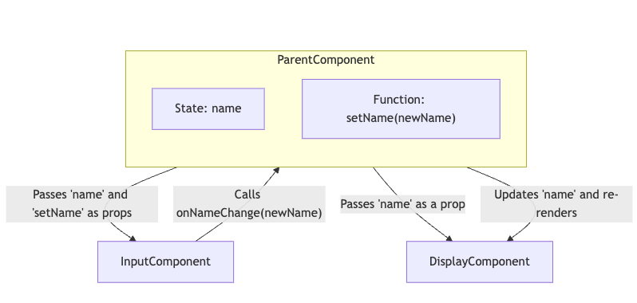

{: style="display: block; margin: 0 auto; width:50%" }

# How share state between components in React

In React, **lifting state** is a pattern used to **share state** between two or more components that don’t have a direct connection to each other but need to share data. By lifting state "up" to a common ancestor, multiple child components can access and update the shared state via props.

## When to Lift State

Lifting state is typically done when:

- **Two sibling components** need access to the same piece of data.
- **Child components** need to communicate with each other through a shared value.
- You need **centralized state management** in a specific part of your component tree.

## How Lifting State Works

1. **Identify the Shared State**: Determine which piece of data needs to be shared between components.
2. **Lift State Up**: Move the shared state up to the nearest common ancestor component where both (or all) child components can access it.
3. **Pass State and Functions as Props**: Pass the shared state and any necessary update functions as props to each child component that needs access.

## Example of Lifting State

Let’s say you have two sibling components: one component allows the user to input a name, and another component displays that name. To share this state, you lift it up to their parent component.

### Step 1: Create Components

- **InputComponent**: Allows the user to type in a name.
- **DisplayComponent**: Displays the name.

### Step 2: Lift State Up to the Parent

1. Move the `name` state to the parent component.
2. Pass `name` and a function to update `name` as props to both child components.

### Code Example

```react
import React, { useState } from "react";

// Child component for input
function InputComponent({ name, onNameChange }) {
  return (
    <input
      type="text"
      value={name}
      onChange={(e) => onNameChange(e.target.value)}
      placeholder="Enter name"
    />
  );
}

// Child component for displaying name
function DisplayComponent({ name }) {
  return <h1>Hello, {name}!</h1>;
}

// Parent component
function ParentComponent() {
  // Shared state lifted to the parent
  const [name, setName] = useState("");

  return (
    <div>
      <InputComponent name={name} onNameChange={setName} />
      <DisplayComponent name={name} />
    </div>
  );
}

export default ParentComponent;
```

## Explanation of the Example

1. **Parent Component**:

   - The `ParentComponent` manages the shared state `name` with `useState`.
   - The `setName` function updates `name`, which is passed down to `InputComponent`.

2. **InputComponent**:

   - Receives `name` and `onNameChange` as props.
   - Displays the current value of `name` in the input field and updates it through `onNameChange` when the user types.

3. **DisplayComponent**:

   - Receives `name` as a prop and displays it in an `<h1>` element.

In this setup, whenever `InputComponent` updates `name` by calling `onNameChange`, the new `name` value is re-rendered in both `InputComponent` and `DisplayComponent`.

## Important Points to Keep in Mind

1. **Only Lift State When Necessary**: Lift state up only if multiple components need access to it. If a single component needs the state, keep it local.
2. **Avoid Prop Drilling**: If you need to pass state across several layers of components, consider using React Context to avoid excessive prop drilling.
3. **One-Way Data Flow**: By lifting state, React’s unidirectional data flow is preserved, making it easier to understand where the state is managed and updated.
4. **Immutability**: When you update state, React re-renders the components that depend on it, which makes lifting state an efficient way to synchronize data between components.

## Benefits of Lifting State

- **Centralized State Management**: By lifting state to a common ancestor, you create a single source of truth, making the state easier to manage and debug.
- **Consistency Across Components**: Any component that receives the lifted state via props will re-render when the state changes, ensuring that all components are always in sync.
- **Enhanced Reusability**: Components can be more reusable because they receive props instead of managing their own local state.

## Common Use Cases for Lifting State

- **Forms and Validation**: For example, managing a form’s inputs and showing validation messages across components.
- **Filterable Lists**: If you have a search input and a list component, you can lift the search term state to filter the list based on the search input.
- **Synchronized Inputs**: When you want multiple input fields across components to be synchronized with the same value.

## Summary

- **Lifting state** involves moving shared state up to the nearest common parent component.
- **Props** are then used to pass the state and update functions to the child components.
- Lifting state is helpful when multiple components need access to the same piece of state, ensuring consistency and a single source of truth.

This pattern helps maintain React’s one-way data flow and makes components more modular and reusable.

## Example of how shared state works

This updated diagram provides a clear view of how **lifting state up** centralizes state management within a common parent component and how data flows between components.

- **ParentComponent**:
  - Now visually contains `state` and `setName` to indicate that `name` is managed within `ParentComponent`.
  - `state` represents the shared data (`name`), and `setName` is the function to update it.
- **InputComponent**:
  - Receives `name` and `setName` (passed as `onNameChange`) from `ParentComponent`.
  - Can trigger `setName` to update `name`.
- **DisplayComponent**:
  - Receives `name` to display, updated automatically when `name` changes in `ParentComponent`.


