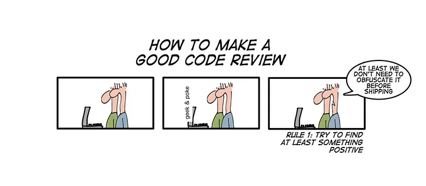

# Code Reviews using pull requests

Conducting a code review using pull requests is a common practice in collaborative software development. It involves team members reviewing changes before they are merged into the main codebase, ensuring quality, consistency, and adherence to project standards. Here's a step-by-step guide on how to conduct a code review using pull requests, along with key considerations to keep in mind:

## 1. **Create a Pull Request**

1. **Initiation**: A developer makes changes in a feature branch and then creates a pull request (PR) to merge these changes into the main branch.
2. **Description**: The PR should include a clear title and description that explains what the changes are, why they were made, and any potential impacts on the codebase.

## 2. **Assign Reviewers**

1. **Selection**: Assign relevant team members as reviewers. Ideally, choose those familiar with the codebase or the area of the code being modified.
2. **Balanced Load**: Distribute reviews evenly among team members to avoid bottlenecks.

## 3. **Conducting the Review**

1. **Understand the Context**: Before diving into the code, reviewers should understand the purpose of the changes by reading the PR description, related tickets, or documentation.
2. **Examine the Code**:
     - **Readability**: Ensure the code is easy to read and understand. Look for clear variable names, appropriate comments, and well-organized code.
     - **Functionality**: Verify that the changes accomplish the intended purpose without introducing bugs. Test the functionality if possible.
     - **Style and Conventions**: Check if the code adheres to the project's coding standards and style guides.
     - **Performance**: Consider the performance implications of the changes, especially for critical sections of the code.
     - **Security**: Review the code for potential security vulnerabilities, such as SQL injection risks or improper input validation.
     - **Modularity**: Ensure that the changes are modular and follow the principles of DRY (Don't Repeat Yourself) and SOLID (Single Responsibility, Open-Closed, Liskov Substitution, Interface Segregation, Dependency Inversion) where applicable.

## 4. **Provide Feedback**

1. **Constructive Criticism**: Offer feedback in a positive and constructive manner. Focus on the code, not the individual.
2. **Specific Suggestions**: Where possible, suggest specific improvements or alternatives, providing code examples if helpful.
3. **Ask Questions**: If something is unclear, ask questions to understand the developer's intentions better.

© geek & poke, <http://geek-and-poke.com>

## 5. **Handle Discussions and Iterations**

1. **Discussion**: Engage in discussions if there are disagreements or different perspectives on how something should be implemented.
2. **Revisions**: The original author should address the feedback by making necessary changes and updating the pull request.
3. **Follow-Up**: Review the changes again if necessary, ensuring that all concerns have been addressed.

## 6. **Approve or Request Changes**

1. **Approval**: If the code meets the required standards and all concerns have been addressed, approve the PR.
2. **Request Changes**: If there are unresolved issues, request changes before the PR can be merged.

## 7. **Merge the Pull Request**

1. **Final Checks**: Before merging, ensure that all checks (such as automated tests) have passed and that there are no conflicts with the base branch.
2. **Merge**: Merge the changes into the main branch using the appropriate method (e.g., squash, rebase, or merge commit) depending on the project's workflow.
3. **Cleanup**: After merging, the feature branch can often be deleted if it's no longer needed.

## Key Considerations

1. **Timeliness**: Conduct reviews promptly to keep the development process flowing smoothly.
2. **Balance**: Ensure the feedback is balanced between pointing out issues and acknowledging good practices or improvements.
3. **Consistency**: Maintain consistency in reviews by applying the same standards across different PRs and reviewers.
4. **Learning Opportunity**: Use code reviews as an opportunity for learning and improving both the code and the team’s skills.

By following these steps and keeping these considerations in mind, a team can conduct effective and efficient code reviews using pull requests, leading to higher-quality code and a more collaborative development process.

## Additional Resources

- [Crafting Better Code Reviews](https://medium.com/@vaidehijoshi/crafting-better-code-reviews-1a5fc00a9312)
