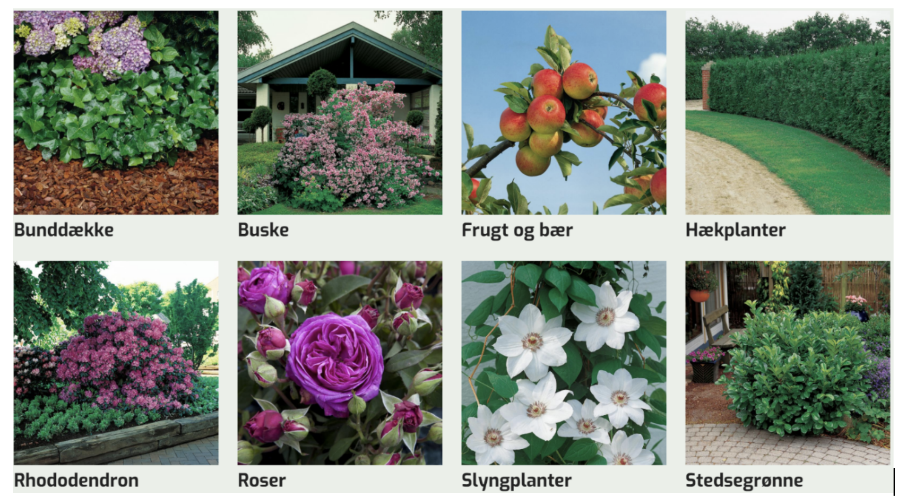

# Mock Exam

### In the subjects Programming and Technology

2023 Oct, at 9:00 AM - 1:00 PM

### Exam rules

All written materials, PCs, laptops, and internet resources are allowed during the exam.

We expect you to use code from your previous assignments and projects, otherwise you will not have time to complete the exam.

Mobile phones and communication with other individuals (including chatbots) other than communication with the examiner and proctor are prohibited.

You are not allowed to save your solutions on external network drives/hosts such as GitHub, Facebook, or similar. Violation of this rule will result in expulsion from the exam, and appropriate sanctions will be imposed on both the sender/uploader and the receiver.

At the end of the exam, you must submit your solution on Wiseflow.

The exam duration is 4 hours, followed by 1 hour of evaluation. During these periods, you may only leave the exam room for restroom breaks. Smoking is not allowed.

The exam set consists of 9 tasks.

In addition to these tasks, you may be asked to answer some additional questions about your answers and any other choices.

Please check that this set contains 4 pages, including the cover.

## Introduction

You are required to program a system for the administrative part of a web shop, including adding new items to the web shop and more.

In addition to programming this system, there will be theoretical questions along the way where you will be asked to explain considerations and provide explanations. These should be written in a document, which should be uploaded to Wiseflow along with your programs.

## Domain Description

Lyngby Garden Center wants to sell garden plants online. Garden plants are displayed with information such as plant type (Roses, Rhododendrons, shrubs, ...), name, size, and price.

More specifically, you need to program a system that can handle the following properties for plants:

- PlantId, a unique identifier
- PlantType
- PlantName
- Price
- MaxHeight

Plant properties/data can be displayed as in the table below:

|PlantId|PlantType|PlantName|MaxHeight|Price
|---|---|---|---|---|
|1|Rose|Albertine|400|199.50|
|2|Bush|Aronia|200|169.50| 
|3| FruitAndBerries|AromaApple|350|399.50|
|4|Rhododendron|Astrid|40|269.50|
|5|Rose | The DarkLady|100|199.50|

There are, of course, many more plants, but they are not shown here.

### Task 1: REST Service Provider with Javalin

1. Create a Java application using Javalin, named 'PlanteShopService.'
2. Implement a PlantDTO class with properties: PlanteId, PlanteType, PlanteNavn, MaksHoejde, Price.
3. Develop a Javalin controller, PlanteController, with the following endpoints:

  - GET /api/plants - Retrieve all plants.
  - GET /api/plants/:id - Retrieve a plant by its ID.
  - GET /api/plants/type/:type - Retrieve plants by type.
  - POST /api/plants - Add a new plant. The ID should be generated by the controller. Return the assigned ID.

4. Create a PlantController interface with the following methods:

  - List<PlantDTO> getAllPlants()
  - PlantDTO getPlantById(int id)
  - List<PlantDTO> getPlantsByType(String type)
  - PlantDTO addPlant(PlantDTO plant)

5. Implement the PlantController interface in a PlanteController class - Manage the list of plants in memory.

### Task 2: REST Errorhandling
1. Implement a REST error handler that returns a JSON object with the following properties:

  - status: The HTTP status code.
  - message: A message describing the error.
  - timestamp: The time of the error.
2. Implement an ExceptionMapper that maps exceptions to the appropriate HTTP status code.

### Task 3: Streams and Generics

1. Implement a method in the PlantController that returns a list of plants with a maximum height of 100 cm using the stream API, filter() and a predicate function.
2. Implement a method in the PlantController that can map a list of PlantDTOs to a list of Strings containing the plant names.
3. Implement a method in the PlantController that can sort a list of PlantDTOs by name using streams, sorted() and a Comparator.
4. Change the PlantController interface to use generics, so it can handle any type of DTO.
5. Create a new DTO class: OwnerDTO with the following properties: id, name, address, phone, email.
6. Implement a new controller: OwnerController using the generic Controller interface.

### Task 4: API Documentation - Use of Swagger

1. Add the API documentation Route to your javalin server

### Task 5: JPA
NOTE: Task 6 is about testing. You have the option to do task 5 and 6 together as TDD.

1. Setup a HibernateConfig class with a method that returns an EntityManagerFactory.
2. Implement a Plant entity class with the following properties: id, type, name, maxHeight, price.
3. Implement an Owner entity class with the following properties: id, name, address, phone, email and a OneToMany relationship to Plant.
4. Make a IPlantDAO interface with the following 7 methods:

- Set<Plant> getAllPlants()
- Plant getPlantById(int id)
- Set<Plant> getPlantsByType(String type)
- Plant addPlant(PlantDTO plant)
- Plant deletePlant(int id)
- Owner addPlantToOwner(Owner owner, Plant)
- Set<Plant> getPlantsByOwner(int id)

5. Implement the DAO interface in a PlantDAO class using JPA and Hibernate.

### Task 6: Create UnitTests for the PlantDAO class
1. Setup @BeforeAll to create the EntityManagerFactory.
2. Setup the @BeforeEach and @AfterEach methods to create the test objects (Plants and Owners).
3. Create a test method for each of the methods in the PlantDAO class.

### Task 7: Create a Test to test the REST endpoints
1. Create a test class for the REST endpoints.
2. Setup @BeforeAll to create the Javalin server, the PlantController and the EntityManagerFactory for test.
3. Setup the @BeforeEach and @AfterEach methods to create the test objects (Plants and Owners).
4. Create a test method for each of the endpoints in the PlantController class.

### Task 8: Deploy REST Service Docker hub

1. Deploy your Rest Service to Docker Hub using github actions.
2. Deploy your REST Service to a cloud platform, such as Digital Ocean.
3. Demonstrate that your REST service provider works from Digital Ocean.
