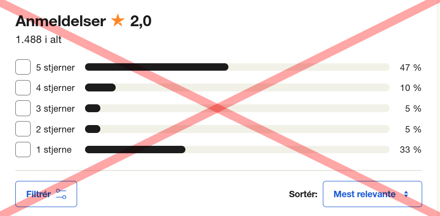

# Web Scraping and Analysis of Apple Reviews

**Read the whole document before you start with the exercises.**

**Introduction:**
This project aims to develop a Java application that scrapes and analyzes customer reviews of Apple 
from the Trustpilot website. The project will utilize JDK 17, Maven, JSoup for web scraping, Java streams, JPA, 
PostgreSql and lambda expressions for data processing, JUnit 5 for testing, and apply Object-Oriented Programming (OOP)
and functional programming concepts.

In this project, you will practise your programming skills by 
- scraping data from a website 
- storing data in a database
- using Java ExecutorService to improve the performance of the web scraping and data storage
- analyzing the data using Java streams and lambda expressions
- testing your code using JUnit 5
- applying OOP and functional programming principles
- creating a report to showcase the analysis results
- creating charts and graphs to visualize the data (optional)
- creating an EER diagram to show the relations between the classes

**Try tu use Streams, Functional Programming and Lambda expressions as much as possible.**
**All analysis and calculations should be done by calling the data from the database.**

**Project Structure:**

1. **Data Scraping:**
    - Use JSoup to scrape data from the Trustpilot page (https://dk.trustpilot.com/review/www.apple.com).
    - Extract the following information from each review:
        - Name of registrant
        - Number of reviews posted by the registrant
        - Country of the registrant
        - Star rating (1 - 5)
        - Title of the review
        - Review content
        - Date of the review
    - Implement pagination handling to collect reviews from multiple pages.

2. **Data Storage:**
    - Create a data structure (classes) to represent the scraped review data.
    - Those classes should be annotated with JPA annotations with the appropriate relations and constraints.
    - Don't just use one class for all the data, but try to think what makes sense to group together (min 3).
    - Here is a list of all the properties you should use in your classes:
        - Name of registrant
        - Number of reviews posted by the registrant
        - Country of the registrant
        - Star rating (1 - 5)
        - Title of the review
        - Review content
        - Date of the review
    - Create an EER diagram to show the relations between the classes.
    - Use DAO classes to store and retrieve the data in the database. Like we did in the previous week. You do not need to implement update and delete methods.
    - Use PostgreSql as the database.

3. **Data Analysis:**
    - Calculate the overall percentage of positive, neutral, and negative reviews based on star ratings.
    - Determine the average star rating for all reviews.
    - Identify the top reviewers (registrants with the most reviews).
    - Calculate the number of reviews posted by each registrant.

**All the data analysis should be done using the data you scraped from each review and not from the already defined analysis
on top of the page. Use it more as a lookup to see if you're on the right path rather than as a way to cheat.**

4. **Multithreading:**
    - Use Java ExecutorService to improve the performance of the web scraping and data storage.
    - Use the ExecutorService to store the scraped data in the database.

5. **Testing:**
    - Write JUnit 5 [unit and integration test](https://www.guru99.com/unit-test-vs-integration-test.html), ensuring that all methods and functions are working as expected.

6. **Reporting (README.md):**
    - Generate reports or summaries showcasing the analysis results.
    - Display the overall percentage, average rating, and other relevant statistics.
    - Present the top reviewers and their review counts.
    - Use Excel or any other tool to create charts and graphs to visualize the data. (Optional but recommended)

**Conclusion:**
This project will provide you with hands-on experience in web scraping, multithreading, data analysis using Java streams and 
lambda expressions, testing with JUnit 5, and applying OOP and functional programming principles.