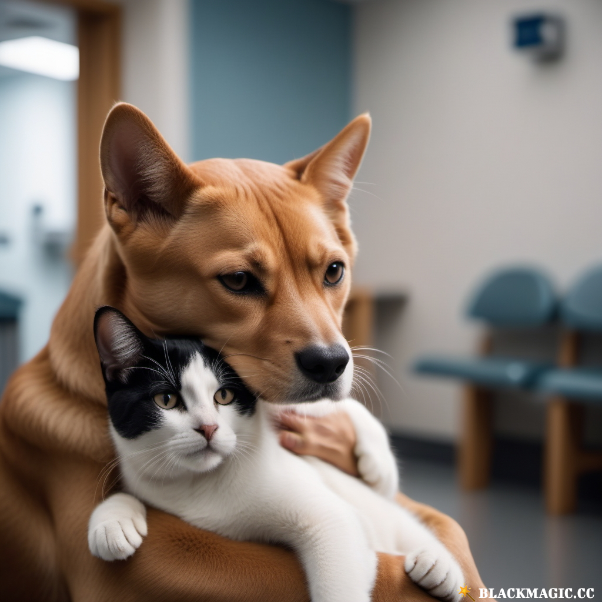

### Day 1 and 2 - Exercise with Javalin and CRUD

# **Project Name:** The Veterinarian

**Project Description:**
As a computer science student, you've been engaged by a local veterinarian clinic, "Paws & Whiskers," to develop a 
RESTful API that will help them manage their patient appointments and information. The clinic has specific requirements 
for GET methods to retrieve essential data.

**Client: Paws & Whiskers Veterinary Clinic**

**Project Requirements:**

1. **Appointment Retrieval:**
    - Create an endpoint to retrieve a list of upcoming appointments.
    - Implement an endpoint to retrieve details of a specific appointment by appointment ID.

2. **Patient (Animal) Information:**
    - Create endpoints to retrieve patient details, including medical history (e.g., allergies, medications, etc.) by patient ID.
    - Develop an endpoint to retrieve a list of all patients.

3. **Endpoint Groups:**
    - Organize routes into two endpoint groups: "Appointments" and "Patients."
    - Set up the server so that all endpoints are under the path `/api/vet/`. https://javalin.io/documentation#configuration
      (For example, the endpoint to retrieve a list of all patients should be `localhost:7071/api/vet/patients`.)
    - Use path params and not query params for the endpoints.

4. **Handlers:**
    - Implement separate handlers (AppointmentHandler, PatientHandler) for each GET endpoint to manage the retrieval logic. 
      (Thomas called them controllers and I called them handlers. Both are correct.)

5. **Data Structures:**
    - Utilize Java Collections to manage appointment and patient data. No need to persist data to a database.

6. **HTTP Methods:**
    - All routes should use HTTP GET methods for retrieving information.

7. **Response Format:**
    - All endpoints should return JSON data, HTTP status codes and content type.
    - Use a http file to test the endpoints.

8. **DTOs (Data Transfer Objects):**
    - Create DTOs to facilitate data transfer between the client and server. A DTO that includes some of the patient's and appointment's information is sufficient.

9. **Logging:**
    - Implement Javalin's `before()` and `after()` methods for logging purposes.

10. **Error Handling:**
    - Make sure to return 404 when a patient or appointment is not found.
11. Set up the server so that all endpoints are under the path `/api/`.

**Business Goals:**
- Enable clinic staff to quickly access essential information about appointments and patients.
- Streamline the process of retrieving patient records and appointment details.
- Improve the efficiency of managing patient data through a RESTful API.

