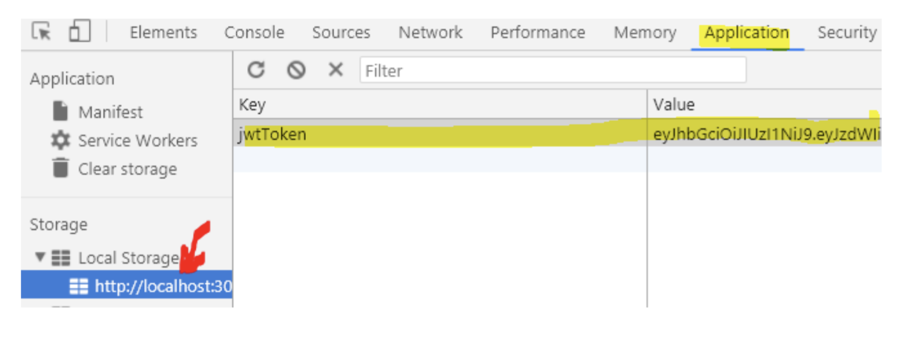

# Tokens and authentication with React (SPA’s)
- In this part, we will create a simple REACT-SPA, that will use the backend created in the first part of the semester. The application must include two views, one for unauthenticated users (the login view below) and one,  rendered after a successful login. 

- The second view should make a request to one of the protected endpoints on the server, and provide a logout button. Both components below are encapsulated in an “outer” component, and we will use the “Lifting state up” pattern to synchronize the two. 


- While you go through this exercise, you should observe how it mirrors all the steps you did, when you tested the backend with Postman.

## Getting started

- This exercise requires your backend to run, and to handle CORS as explained in a previous session.
 
1. Create a new react project and clean it up “the usual way”.

2. Create a new file in the src folder called apiFacade.js and paste in the code below:
- It includes the suggested handleHttpErrors(res) function from this document + a customized version of the makeOptions() function from the same document, changed to handle tokens.

- **Remember** to do what it says in the first line: 
```js
const URL = "ADD URL TO YOU SERVER";


function handleHttpErrors(res) {
 if (!res.ok) {
   return Promise.reject({ status: res.status, fullError: res.json() })
 }
 return res.json();
}


function apiFacade() {
 /* Insert utility-methods from a later step (d) here (REMEMBER to uncomment in the returned object when you do)*/
 
const login = (user, password) => {/*TODO*/  }
const fetchData = () => {/*TODO */  }
const makeOptions= (method,addToken,body) =>{
   var opts = {
     method: method,
     headers: {
       "Content-type": "application/json",
       'Accept': 'application/json',
     }
   }
   if (addToken && loggedIn()) {
     opts.headers["Authentication"] = `Baerer ${getToken()}`;
   }
   if (body) {
     opts.body = JSON.stringify(body);
   }
   return opts;
 }
 return {
     makeOptions,
     setToken,
     //getToken,
     //loggedIn,
     //login,
     //logout,
     fetchData
 }
}
const facade = apiFacade();
export default facade;

3. Remove all code in App.js and paste in the code below:

import React, { useState,useEffect } from "react"
import facade from "./apiFacade";


function LogIn({ login }) {
  const init = { username: "", password: "" };
  const [loginCredentials, setLoginCredentials] = useState(init);


  const performLogin = (evt) => {
    evt.preventDefault();
    login(loginCredentials.username, loginCredentials.password);
  }
  const onChange = (evt) => {
    setLoginCredentials({ ...loginCredentials,[evt.target.id]: evt.target.value })
  }


  return (
    <div>
      <h2>Login</h2>
      <form onChange={onChange} >
        <input placeholder="User Name" id="username" />
        <input placeholder="Password" id="password" />
        <button onClick={performLogin}>Login</button>
      </form>
    </div>
  )


}
function LoggedIn() {
  const [dataFromServer, setDataFromServer] = useState("Loading...")
  
  useEffect(() => { /*TODO*/}, [])


  return (
    <div>
      <h2>Data Received from server</h2>
      <h3>{dataFromServer}</h3>
    </div>
  )


}


function App() {
  const [loggedIn, setLoggedIn] = useState(false)


  const logout = () => { /*TODO*/ } 
  const login = (user, pass) => {/*TODO*/} 


  return (
    <div>
      {!loggedIn ? (<LogIn login={login} />) :
        (<div>
          <LoggedIn />
          <button onClick={logout}>Logout</button>
        </div>)}
    </div>
  )


}
export default App;
```

4. The following steps will mirror how you logged in via Postman, and then made a REST call to a protected resource by adding the token to the request.

- We need to store the token on the client, after a successful login, so add these utility methods to the apiFacade function:

```js 
const setToken = (token) => {
    localStorage.setItem('jwtToken', token)
  }
const getToken = () => {
  return localStorage.getItem('jwtToken')
}
const loggedIn = () => {
  const loggedIn = getToken() != null;
  return loggedIn;
}
const logout = () => {
  localStorage.removeItem("jwtToken");
}

```

Important: Also un-comment the four functions in the object we are returning in bottom of the function

We have several options when it comes to “where to store the Token” (cookies, localstorage and sessionstorage + more “sophisticated” options). 
Important: In this example localStorage has been chosen, since it provides some usability advantages, but it’s not necessarily the most secure choice. Read here for additional info.

5. Now we are ready to login, so add this code to the apiFacade’s login function

```js
const options = makeOptions("POST", true,{username: user, password: password });
return fetch(URL + "/api/login", options)
    .then(handleHttpErrors)
    .then(res => {setToken(res.token) })
```

6. In App.js, in the App component, replace the TODO in login with the code given below. Observe that this is a method used to “lift state up”. It is passed down to the Login component and called from here. Also observe that we are changing the value of the state variable loggedIn, to trigger a re-render, which will “switch” components.

```js
facade.login(user,pass)
.then(res =>setLoggedIn(true));
```


7. Verify that you can login, and also verify with developer tools, that the token is stored in localStorage



8. Now add the code to logout. In the App-component replace the TODO in logout with the code below:
```js
facade.logout()
setLoggedIn(false)
```

- Verify that we can `logout` and go back to the `login page`.

- Answer these questions before you continue:
- Did this logout involve the server
- Is the token (if kept somewhere, still valid?)
- If your  answer to the question above was yes, is this a problem?, and if, how could it have been solved?

9. The only thing missing to complete this simple example, is to make a request, using the token, up against a protected endpoint.
- Add this code to `fetchData()` in the apiFacade:

```js
const options = makeOptions("GET",true); //True add's the token
return fetch(URL + "/api/info/user", options).then(handleHttpErrors);
```

- Do NOT continue, before you have convinced yourself about how the token was added to the authentication header for the outgoing request.

10. Now, in the useEffect method in the LoggedIn component, add this call to fetchData added to the facade in the previous step:
```js
facade.fetchData().then(data=> setDataFromServer(data.msg));
```

11. Verify that you can login, and when logged in, that you can fetch data from the protected endpoint on the server.

- Important: While you are testing this, make sure to follow on in the network-tab in developer tools. You should observe all the following topics:
- How username and password are passed to server
- How the server sets the CORS headers
- How the server returns the token (in the Response)
- How we (you) attach the token to the outgoing request up against the protected endpoint

12. Finally, to add the final touch to this small exercise, add error-handling where relevant (wrong credentials when logging in etc.)
