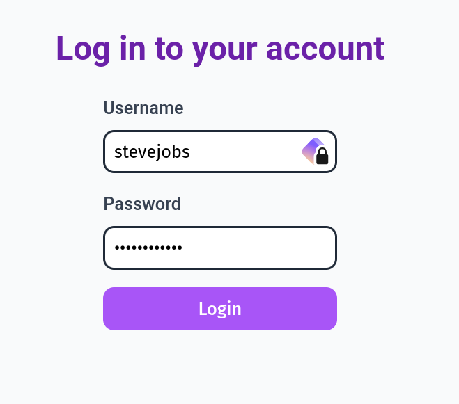
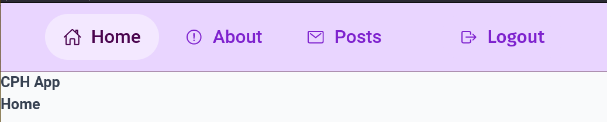
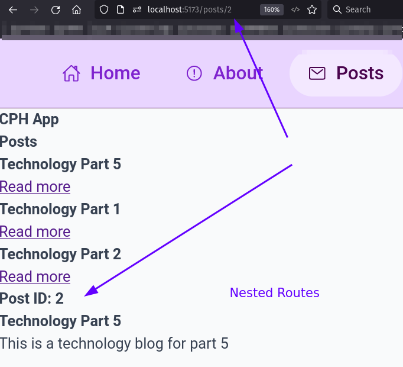

## Tuesday: React III

### Learning Goals

- Understand how to use React Router Dom
- Understand how to use Styled Components
- Understand how to use PropTypes
- Understand GitHub actions
- Understand how to deploy your backend project to your Droplet

### Agenda

We want to create a simple frontend project that uses React Router Dom, Styled Components, and PropTypes. We also want to
add a CI/CD pipeline using GitHub actions. The GitHub actions should run each time we push to the main branch, run all our tests, create a new Docker image
and push the new image to our Docker Hub account. We also want to deploy our backend project to our Droplet.

We also need to add authentication to our frontend project. We will use one of your old backend project to use for authentication.
The backend project should have the following endpoints:

Authentication:
- POST /register
- POST /login

A entity of your choice: (example: persons, cars, books, etc.)
- GET /all
- GET /one
- POST /create
- PUT /update

We will use the backend project to authenticate the user and get a token. We will use the token to access the entity endpoints.
At the frontend we need to be able to login, logout, register and be able to perform CRUD operations on the entity.

### Exercises

The steps below are guidelines on how to create the frontend project. You can of course add more features if you want. Or
if you want that the login and register form should be a modal instead of a new page, that is also fine. The most important
thing is that you understand how to use React Router Dom, Styled Components, PropTypes and GitHub actions and that you 
be able to  login, logout, register and perform CRUD operations on the entity and show the data on the browser.

1. Create a new React project using `create-react-app` or `Vite`.
2. Create a new component called `Header` that will be used in all your pages.
3. The Header should have a navigation bar with the following links: (You can of course add more links if you want)
   - Home
   - Login
   - Register
   - Entity (This should only be visible if the user is logged in)
   - Logout (This should only be visible if the user is logged in)
   - Settings (This should only be visible if admin is logged in)
4. Add routing to your project using React Router Dom.
5. Add global styles to your project using Styled Components.
6. Create a new component called `Home` that will be the landing page of your project.
7. Create a new component called `Login` that will be used to login the user.
8. Create a new component called `Register` that will be used to register the user.
9. Create a new component called `Entity` that will be used to show all the entities.
10. Create a new component called `EntityDetails` that will be used to show the details of one entity.
11. Create a new component called `EntityCreate` that will be used to create a new entity.
12. For all your components, add PropTypes to validate the props.
13. For all your components, add Styled Components to style your components.
14. Add a apiFacade file that will be used to fetch data from your backend project.

A part of the exercise is to deploy your backend project to your Droplet. All links and resources can be found in the Resources.md file on Moodle.