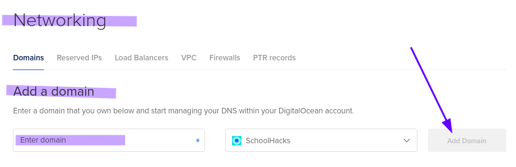
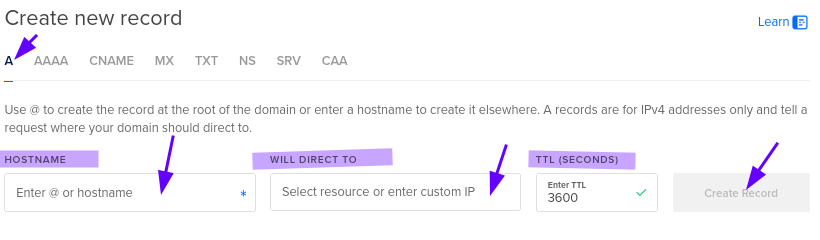
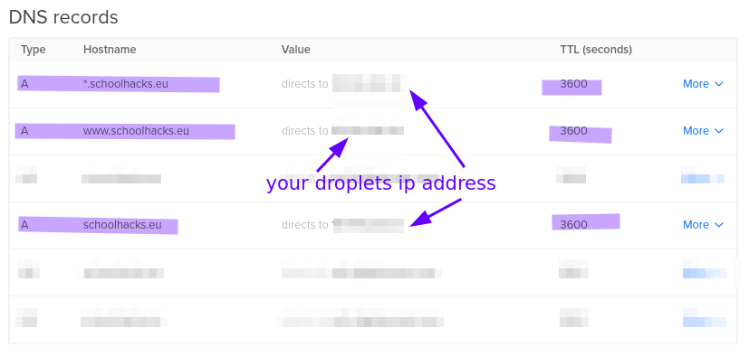

# Change DNS Nameserver on DigitalOcean

### Part 1: Add DigitalOcean Nameservers to your domain provider

Your domain has to be pointing to DigitalOcean DNS servers. This is done by adding the DigitalOcean nameservers to your domain provider.
[How to do](https://docs.digitalocean.com/products/networking/dns/getting-started/dns-registrars/)

If you have a dk country code domain, you need to change the nameserver on DK Hostmaster.
[How to do](https://punktum.dk/artikler/skift-af-navneservere-og-kontrol-af-opsaetningen)

### Part 2: Add your domain to a DigitalOcean droplet

- Go to your DigitalOcean dashboard and click on the Networking tab.
- Click on the Domains tab and then click on the Add Domain button.
- Enter your domain name and click on the Add Domain button.

- Click on the domain you just added and then click on the Create Record button.

- Add an A record with the following settings:
  - Type: A
  - Hostname: @
  - Will direct to: Your droplet IP address
  - TTL: 3600
- Add a A record with the following settings:
  - Type: A
  - Hostname: www
  - Will direct to: Your droplet IP address
  - TTL: 3600
- Add a A record with the following settings:
  - Type: A
  - Hostname: *
  - Will direct to: Your droplet IP address
  - TTL: 3600

It should look like this:

The **@** record is for the root domain, the **www** record is for the www subdomain, and the **\*** record is for all other subdomains.'

The domain is now pointing to your DigitalOcean droplet.