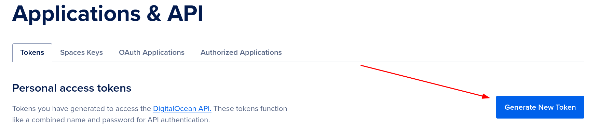
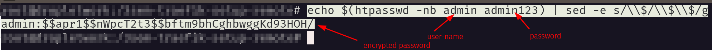
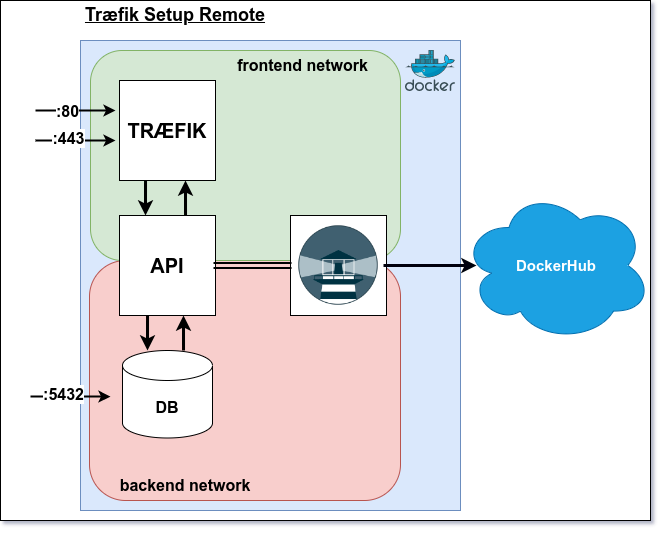

## Deployment Part 3 Træfik

Before you begin make sure you have the following:
- Your domain is pointing to DigitalOcean DNS servers. 
- Wildcard DNS record for your domain (*.your_domain.com)


### Part 1:

Your domain has to be pointing to DigitalOcean DNS servers. This is done by adding the DigitalOcean nameservers to 
your domain provider.
[How to do](https://docs.digitalocean.com/products/networking/dns/getting-started/dns-registrars/)

### Part 2:

- Generate a digital ocean token on [DigitalOcean](https://cloud.digitalocean.com/account/api/tokens).



- Copy the token and save it somewhere safe. You will need it later.

### Part 3:  Install apache2-utils inside your droplet terminal

```bash
  sudo apt-get install apache2-utils
``` 

### Part 4: Generate a traefik hashed dashboard login (droplet linux terminal )

```bash
  echo $(htpasswd -nb <your_username> <your_password>) | sed -e s/\\$/\\$\\$/g
```



- Copy the output and save it somewhere safe. You will need it later.

### Part 5: Create a folder called acme inside the project folder

```bash
  mkdir acme
```

### Part 6: Inside the acme folder create a file called acme.json

```bash
  touch acme/acme.json
```

### Part 7: Add permissions for the acme.json file and folder

```bash
  chmod 600 ./acme
  chmod 600 ./acme/acme.json
```

### Part 8: Create a .env file inside the project folder and add the following environment variables

```bash
# Lets-encrypt - Digital Ocean
PROVIDER=digitalocean
EMAIL=<your_email>
ACME_STORAGE=/etc/traefik/acme/acme.json
DO_AUTH_TOKEN=<your_digital_ocean_token> (see step 2)

# Traefik
TRAFIK_DOMAIN=traefik.<your_domain>
DASHBOARD_AUTH=<your_traefik_dashboard_login> (see step 3 and 4)

# Rest API
API_DOMAIN=api.<your_domain_name>

# Frontend
FRONTEND_DOMAIN=<your_domain_name>

# Postgres
POSTGRES_USER=<your_postgres_user>
POSTGRES_PASSWORD=<your_postgres_password>

# Watchtower
REPO_USER=<your_docker_hub_username>
REPO_PASS=<your_docker_hub_password>

# REST API SETUP
CONNECTION_STR=jdbc:postgresql://db:5432/
DB_USERNAME=<your_postgres_user>
DB_PASSWORD=<your_postgres_password>
DEPLOYED=TRUE
SECRET_KEY=super_secret_key (has to include at least 32 characters letters and numbers)
TOKEN_EXPIRE_TIME=1800000 (30 minutes)
ISSUER=<your_domain> or something like "3sem.dk"

```

### Part 9: Create a docker-compose.yml file inside the project folder and add the following code from the link below

- [docker-compose gist](https://gist.github.com/tysker/0faa2bd46cddbda32f26d4f944120516)



