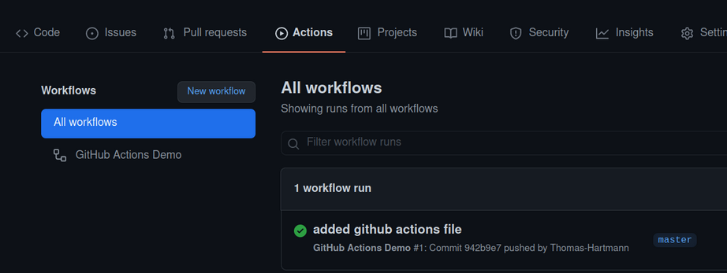

## Continuous integration (CI) with github actions 


### PART 1: Getting Started

This guide briefly explains the idea of continuous integration (CI) and gives a step-by-step guide to implement a simple 
CI setup using git and github actions.

**Important resources:**

[Github actions reference docs](https://docs.github.com/en/actions/using-workflows/workflow-syntax-for-github-actions) (These are useful for looking up syntax. Not for reading in total)
[Building and testing java applications with maven](https://docs.github.com/en/actions/automating-builds-and-tests/building-and-testing-java-with-maven) (Read it. Only about one page)

#### What is continuous integration?

1. The idea of continuous integration is simply to merge developing effort into a central, or integrated, environment.
2. The main reason is to avoid heterogeneous environments. Merging code from many developers can be hard because of local dependencies or settings which ‘works on my machine’ (also known as integration hell).
3. In continuous integration, the code will be pushed to a different clean server and tested, before being deployed to production.
4. In practices like eXtreme Programming (XP) where tests are put in place before code, automated testing (with for instance JUnit) is exploited to act as a ‘guard’ to the production environment. If the tests are green the code can be released. If they are not green, someone needs to cough up a good excuse for ruining production code.
5. This becomes especially useful if testing can be integrated into the normal development flow.
6. A common method is to use versioning tools like git. You are using this anyway, so in a sense, you can get CI for free.
7. Git and Github is especially good at this because it features commit hooks which can be run whenever someone is committing. By using these hooks, tests can be set up to run automatically on a build server, when someone pushes to a shared repository.
8. This guide will show you how you can use CI with git and “github actions”.

#### What is github actions?

1. Github actions is a CI/CD tool provided by github.
2. It is free for open source projects and has a generous free tier for private projects.
3. It is very easy to get started with and has a lot of built in functionality.
4. It is also possible to use other CI/CD tools like Jenkins, Travis CI, Circle CI, etc. But this guide will focus on github actions.
5. Github actions is configured using yaml files. These files are called workflows and are placed in the .github/workflows folder in your repository.
6. A workflow is triggered by an event. For instance, a push to a branch, a pull request, a new release, etc.
7. A workflow consists of one or more jobs. A job is a set of steps that are executed on a runner.
8. A runner is a virtual machine that executes the steps in a job. Github provides runners for linux, windows and macos. It is also possible to host your own runners.
9. A step is a single task that can be executed on a runner. For instance, running a shell command, checking out code, publishing a docker image, etc.

#### Setting up a GitHub repository

For this exercise, you should fork and clone the following repository:

```
    https://github.com/HartmannDemoCode/ci_actions
```

This is a very simple Java project which contains a function which returns the integer 10, along with a single test that 
verifies that the method actually returns 10. The project uses Maven to run the test and fetch dependencies. After 
adding the project to your own GitHub account, try to pull it and run the test.

#### Using Actions
The goal of this exercise is to tell our CI server (Github actions server) to monitor and watch code being pushed to our 
repository. Whenever GA figures that out, it should run tests on the code to check whether a developer committed and 
pushed some bad (untested) code. 

1. CI using GitHub Actions offers workflows that can build the code in your repository and run your tests. Workflows can run on GitHub-hosted virtual machines, or on machines that you host yourself. 
2. To figure out which language and code to run, GA uses a configuration file (.yml file) which must be placed in the project root inside ./github/workflows/. Take a look at the file in our project, it is called .github-actions-demo.yml (notice the . in the beginning). 
3. Goto to github actions tab and enable workflows (first time only). 
4. With the cloned project you should add all files to git and make an initial commit, then push your repository to github. On the github repository page click on: “Actions” in the top menu:



5. And see that 1 workflow was run. Click on the commit message and then on the “explore github actions” button to see the details of the workflows that was run based on the yml file in .github/workflows folder.

### PART 2: testing with maven

We want the build server to run our unit tests to see if the committed code passes the tests. So this time we will create a new yaml file.

* A workflow is a configurable automated process made up of one or more jobs. We must create a YAML file to define our workflow configuration. We can create several yaml files on the same repo as long as we put them in the workflows folder.
* Create the yaml file in the workflows folder, and call it maven.yml and then take a look at: ```https://docs.github.com/en/actions/guides/building-and-testing-java-with-maven```
* Copy the content below into the file and commit and push it to github. Then go to the actions tab and see that the workflow is triggered and runs the tests.

```YAML
name: Java CI

on: [push]

jobs:
  build:
    runs-on: ubuntu-latest

    steps:
      - uses: actions/checkout@v2
      - name: Set up JDK 11
        uses: actions/setup-java@v2
        with:
          java-version: '11'
          distribution: 'adopt'
      - name: Build with Maven
        run: mvn --batch-mode --update-snapshots verify

```

* The first line is the name of the workflow. It is not important, but it is good practice to give it a descriptive name.
* The second line defines when the workflow should run. In this case, it will run on every push to the repository.
* The third line defines a job. A job is a set of steps that are executed on a runner. In this case, the job is called build and it will run on the latest version of ubuntu.
* The fourth line defines the steps that should be executed in the job. The first step is to check out the code from the repository. The second step is to set up java 11. The third step is to build the project using maven.
* The last step is to run the tests. This is done by running the command mvn --batch-mode --update-snapshots verify. The verify command will run the tests and fail if any of the tests fail.
* Commit and push the file to github and see that the workflow is triggered and runs the tests.